<!-- TOC -->
* [**Acknowledgements**](#acknowledgements)
* [**Setting up, getting started**](#setting-up-getting-started)
* [**Design**](#design)
  * [Architecture](#architecture)
  * [UI component](#ui-component)
  * [Logic component](#logic-component)
  * [Model component](#model-component)
  * [Storage component](#storage-component)
  * [Common classes](#common-classes)
* [**Implementation**](#implementation)
  * [Adding a person: `add`](#adding-a-person-add)
  * [Editing a person: `edit`](#editing-a-person-edit)
  * [Finding a person: `find`](#finding-a-person-find)
  * [Adding a tag: `addtag`](#adding-a-tag-addtag)
  * [Adding a meeting: `addmeet`](#adding-a-meeting-addmeet)
* [**Documentation, logging, testing, configuration, dev-ops**](#documentation-logging-testing-configuration-dev-ops)
* [**Appendix: Requirements**](#appendix-requirements)
  * [Product scope](#product-scope)
  * [User stories](#user-stories)
  * [Use cases](#use-cases)
  * [Non-functional requirements](#non-functional-requirements)
  * [Glossary](#glossary)
* [**Appendix: Effort**](#appendix-effort)
  * [Overview](#overview)
  * [Extending the Architecture](#extending-the-architecture)
  * [Entity Relationships](#entity-relationships)
  * [Understanding and Adapting AB3](#understanding-and-adapting-ab3)
  * [Conclusion](#conclusion)
* [**Appendix: Instructions for manual testing**](#appendix-instructions-for-manual-testing)
  * [Launch and shutdown](#launch-and-shutdown)
  * [Getting started](#getting-started)
  * [Adding and managing contacts](#adding-and-managing-contacts)
  * [Working with tags and favourites](#working-with-tags-and-favourites)
  * [Searching and filtering contacts](#searching-and-filtering-contacts)
  * [Managing meetings](#managing-meetings)
  * [Cleaning up](#cleaning-up)
  * [Saving data](#saving-data)
    * [Missing file test](#missing-file-test)
    * [Corrupted file test](#corrupted-file-test)

<div style="page-break-after: always;"></div>

--------------------------------------------------------------------------------------------------------------------

## **Acknowledgements**

* This project is based on the AddressBook-Level3 project created by the [SE-EDU initiative](https://se-education.org).
* Our User Guide format was inspired by previous projects
  ([LambdaLab UG](https://github.com/AY2526S1-CS2103T-T09-3/tp/blob/master/docs/UserGuide.md),
  [HealthNote UG](https://github.com/AY2526S1-CS2103T-F11-1/tp/blob/master/docs/UserGuide.md)),
  although our application and concept are entirely different.
* Our team of five used AI tools such as ChatGPT and Claude to assist certain parts of the development process.
These tools were used mainly for debugging, and auto-completing code for both the main files and test cases.
All final code was reviewed, adapted and tested before inclusion in the project.
--------------------------------------------------------------------------------------------------------------------

## **Setting up, getting started**

Refer to the guide [_Setting up and getting started_](SettingUp.md).

--------------------------------------------------------------------------------------------------------------------

## **Design**

<div markdown="span" class="alert alert-primary">

> 💡 **Tip:** The `.puml` files used to create diagrams are in this document `docs/diagrams` folder. Refer to the [_PlantUML Tutorial_ at se-edu/guides](https://se-education.org/guides/tutorials/plantUml.html) to learn how to create and edit diagrams.
</div>

### Architecture


The ***Architecture Diagram*** given above explains the high-level design of the App.

Given below is a quick overview of main components and how they interact with each other.

**Main components of the architecture**

**`Main`** (consisting of classes [`Main`](https://github.com/AY2526S2-CS2103T-T12-3/tp/blob/master/src/main/java/seedu/address/Main.java) and [`MainApp`](https://github.com/AY2526S2-CS2103T-T12-3/tp/blob/master/src/main/java/seedu/address/MainApp.java)) is in charge of the app launch and shut down.
* At app launch, it initializes the other components in the correct sequence, and connects them up with each other.
* At shut down, it shuts down the other components and invokes cleanup methods where necessary.

The bulk of the app's work is done by the following four components:

* [**`UI`**](#ui-component): The UI of the App.
* [**`Logic`**](#logic-component): The command executor.
* [**`Model`**](#model-component): Holds the data of the App in memory.
* [**`Storage`**](#storage-component): Reads data from, and writes data to, the hard disk.

[**`Commons`**](#common-classes) represents a collection of classes used by multiple other components.

**How the architecture components interact with each other**

The *Sequence Diagram* below shows how the components interact with each other for the scenario where the user issues the command `delete 1`.


Each of the four main components (also shown in the diagram above),

* defines its *API* in an `interface` with the same name as the Component.
* implements its functionality using a concrete `{Component Name}Manager` class (which follows the corresponding API `interface` mentioned in the previous point.

<div style="page-break-after: always;"></div>

For example, the `Logic` component defines its API in the `Logic.java` interface and implements its functionality using the `LogicManager.java` class which follows the `Logic` interface. Other components interact with a given component through its interface rather than the concrete class (reason: to prevent outside component's being coupled to the implementation of a component), as illustrated in the (partial) class diagram below.


The sections below give more details of each component.

<div style="page-break-after: always;"></div>

### UI component

**API** : [`Ui.java`](https://github.com/AY2526S2-CS2103T-T12-3/tp/blob/master/src/main/java/seedu/address/ui/Ui.java)

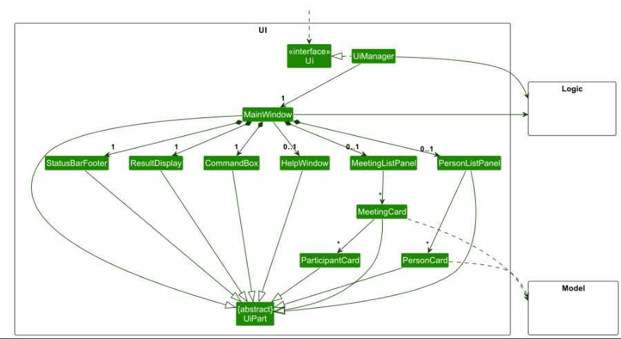

The UI consists of a `MainWindow` that is made up of several parts such as `CommandBox`, `ResultDisplay`, `PersonListPanel`, `MeetingListPanel`, and `StatusBarFooter`.

All these components, including the `MainWindow`, inherit from the abstract `UiPart` class, which captures the common functionality shared by GUI components.

The `UI` component uses the JavaFx UI framework. The layout of these UI parts are defined in matching `.fxml` files that are in the `src/main/resources/view` folder.
For example, the layout of the [`MainWindow`](https://github.com/AY2526S2-CS2103T-T12-3/tp/blob/master/src/main/java/seedu/address/ui/MainWindow.java) is specified in [`MainWindow.fxml`](https://github.com/AY2526S2-CS2103T-T12-3/tp/blob/master/src/main/resources/view/MainWindow.fxml).

The `UI` component:

* executes user commands using the `Logic` component.
* listens for changes to `Model` data so that the UI can be updated with the modified data.
* switches between different views (`PersonListPanel` and `MeetingListPanel`) based on user interaction.
* keeps a reference to the `Logic` component, because the `UI` relies on the `Logic` to execute commands.
* depends on the `Model` component, as some `UI` component (like `MeetingItem`) needs to find the `Person` referred by a `ParticipantID`.

The `CommandHistory` component:

* keeps track of commands that the user have entered in the `CommandHistory`.
* allows the user to shift through their previously entered commands via `prevCommand()` and `nextCommand()`.
* Usage:
  1. Add commands into the history using `add()`. Internally, this also resets the index to point at the end of the list.
  2. Go to the previous command using `prevCommand()`. Note that the current draft needs to be passed in. This is because the `CommandHistory` keeps track of the user draft (the text that the user is currently editing). Internally, this method simply shifts the index to the previous command.
  3. Go to the next command using `nextCommand()`. The current draft needs to be passed in as well. Internally, this method simply shifts the index to the next command and returns the command at that position OR the draft if `index == list.size()`.
* Example usage:
  ```
  CommandHistory ch = new CommandHistory();

  // Assume the user has entered these two commands.
  ch.add("first command");
  ch.add("second command");

  // userDraft is the text in the CommandBox.
  String userDraft = "draft command";

  userDraft = ch.prevCommand(userDraft); // userDraft becomes "second command".
  userDraft = ch.prevCommand(userDraft); // userDraft becomes "first command".
  userDraft = ch.nextCommand(userDraft); // userDraft becomes "second command".
  userDraft = ch.nextCommand(userDraft); // userDraft becomes "draft command".
  ```
* `CommandHistory` sequence diagram:<br>
  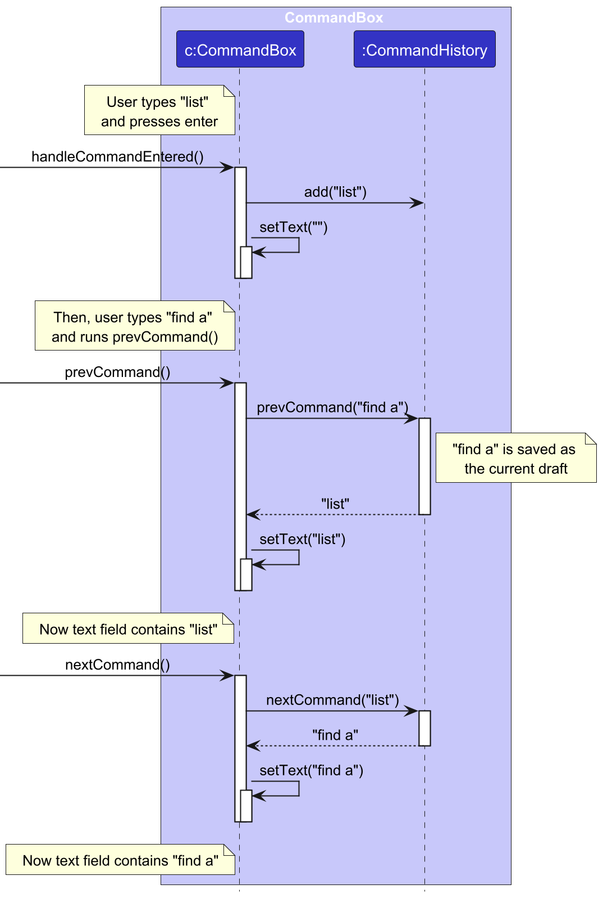

<div style="page-break-after: always;"></div>

### Logic component

**API** : [`Logic.java`](http://github.com/AY2526S2-CS2103T-T12-3/tp/blob/master/src/main/java/seedu/address/logic/Logic.java)

Here's a (partial) class diagram of the `Logic` component:


<div style="page-break-after: always;"></div>

The sequence diagram below illustrates the interactions within the `Logic` component, taking `execute("delete 1")` API call as an example.


<div markdown="span" class="alert alert-info">

>❗**Note:** The lifeline for `DeleteCommandParser` should end at the destroy marker (X) but due to a limitation of PlantUML, the lifeline continues till the end of diagram.

</div>

How the `Logic` component works:

1. When `Logic` is called upon to execute a command, it is passed to an `AddressBookParser` object which in turn creates a parser that matches the command (e.g., `DeleteCommandParser`) and uses it to parse the command.
1. This results in a `Command` object (more precisely, an object of one of its subclasses e.g., `DeleteCommand`) which is executed by the `LogicManager`.
1. The command can communicate with the `Model` when it is executed (e.g. to delete a person).<br>
   Note that although this is shown as a single step in the diagram above (for simplicity), in the code it can take several interactions (between the command object and the `Model`) to achieve.
1. The result of the command execution is encapsulated as a `CommandResult` object which is returned back from `Logic`.

<div style="page-break-after: always;"></div>

Here are the other classes in `Logic` (omitted from the class diagram above) that are used for parsing a user command:


How the parsing works:
* When called upon to parse a user command, the `AddressBookParser` class creates an `XYZCommandParser` (`XYZ` is a placeholder for the specific command name e.g., `AddCommandParser`) which uses the other classes shown above to parse the user command and create a `XYZCommand` object (e.g., `AddCommand`) which the `AddressBookParser` returns back as a `Command` object.
* All `XYZCommandParser` classes (e.g., `AddCommandParser`, `DeleteCommandParser`, ...) inherit from the `Parser` interface so that they can be treated similarly where possible e.g, during testing.

<div style="page-break-after: always;"></div>

### Model component
**API** : [`Model.java`](https://github.com/AY2526S2-CS2103T-T12-3/tp/blob/master/src/main/java/seedu/address/model/Model.java)

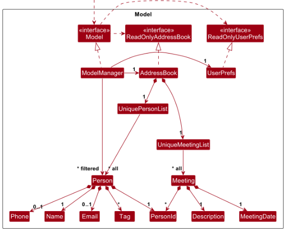 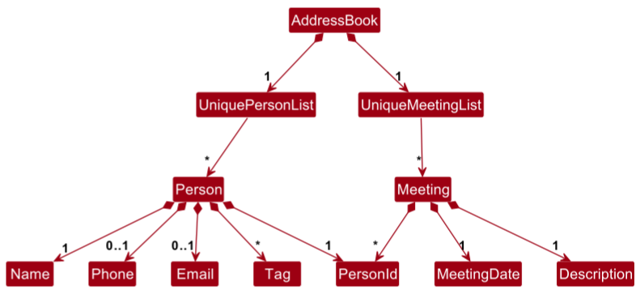


The `Model` component:

* stores the address book data i.e., all `Person` objects (which are contained in a `UniquePersonList` object)
and all `Meeting` objects (which are contained in a `UniqueMeetingList` object).

* stores the currently 'selected' `Person` objects (e.g., results of a search query) as a separate _filtered_ list which is exposed to outsiders as an unmodifiable `ObservableList<Person>` that can be 'observed' e.g. the UI can be bound to this list so that the UI automatically updates when the data in the list change.

* stores the currently 'selected' `Meeting` objects as a separate _filtered_ list which is exposed as an unmodifiable `ObservableList<Meeting>`that can be 'observed'.

* stores a `UserPref` object that represents the user’s preferences. This is exposed to the outside as a `ReadOnlyUserPref` objects.

* does not depend on any of the other three components (as the `Model` represents data entities of the domain, they should make sense on their own without depending on other components)

### Storage component

**API** : [`Storage.java`](https://github.com/AY2526S2-CS2103T-T12-3/tp/blob/master/src/main/java/seedu/address/storage/Storage.java)

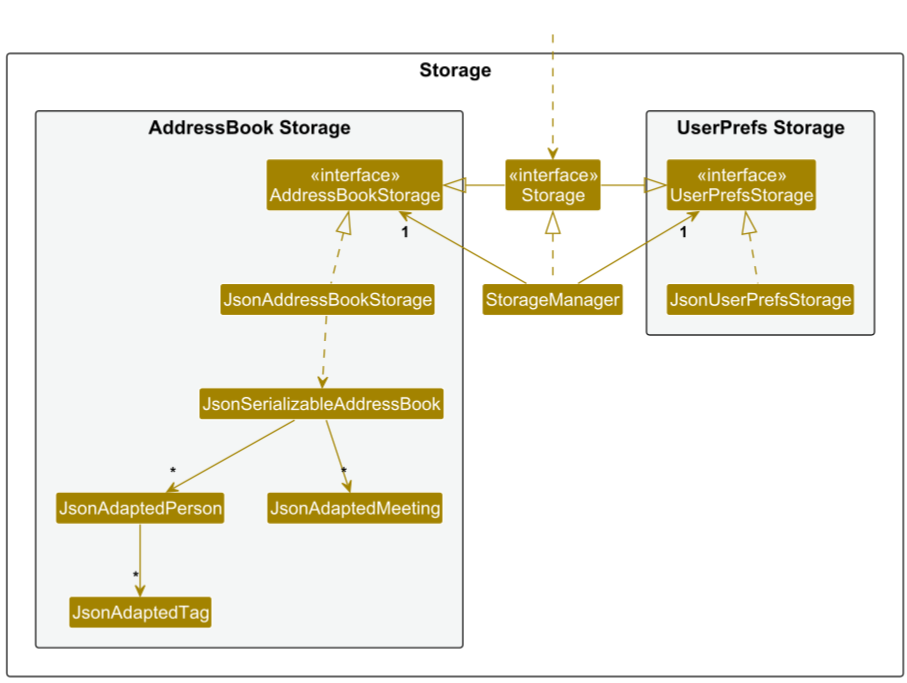

The `Storage` component:
* can save both address book data and user preference data in JSON format, and read them back into corresponding objects.
* inherits from both `AddressBookStorage` and `UserPrefStorage`, which means it can be treated as either one (if only the functionality of only one is needed).
* depends on some classes in the `Model` component (because the `Storage` component's job is to save/retrieve objects that belong to the `Model`).

### Common classes

Classes used by multiple components are in the `seedu.address.commons` package.

--------------------------------------------------------------------------------------------------------------------

<div style="page-break-after: always;"></div>

--------------------------------------------------------------------------------------------------------------------

## **Implementation**

This section describes some noteworthy details on how certain features are implemented.

### Adding a person: `add`

The `add` command is used to insert a new person into the contacts list. The name field (`n/NAME`) must always be provided,
while at least one contact detail — either phone (`p/PHONE`) or email (`e/EMAIL`)—is required. Tags (`t/TAG`) are optional.

Input processing is performed by `AddCommandParser`, which tokenizes the user input and ensures that the following conditions are met:

- Name is present
- At least one of phone or email is provided
- Required prefixes (e.g. `n/`, `p/`, `e/`, `t/`) are valid
- Preamble is empty
- All field values are valid

If any of these checks fail, a `ParseException` is thrown.

Once the input is successfully parsed, a `Person` object is instantiated. As part of its construction, a `PersonId` is generated automatically, ensuring that each person has a unique identifier.

When the command is executed, `AddCommand` invokes `Model#hasPerson(Person)` to determine if the person already exists in the contacts list.
A duplicate is defined as a person with the same name, and either the same phone number or the same email as an existing entry.

If the person is not a duplicate, the person is added via `Model#addPerson(Person)` and a `CommandResult` is returned.

Otherwise, a `CommandException` is thrown.

<div style="page-break-after: always;"></div>

The following sequence diagram and activity diagram illustrate the flow of parsing and execution for the `add` command.
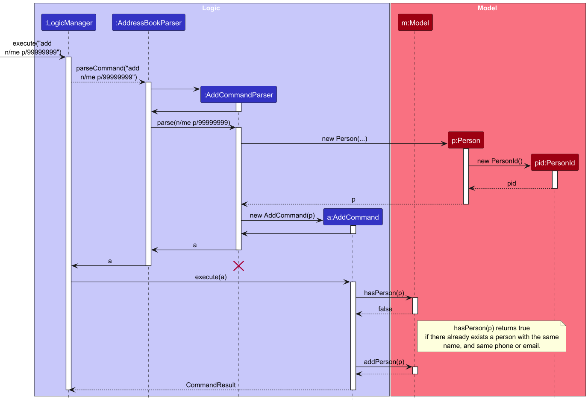

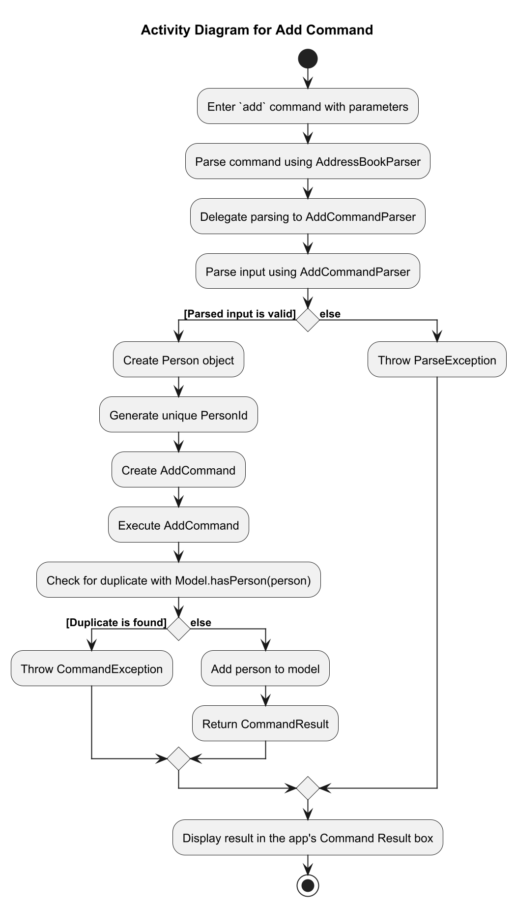

<div style="page-break-after: always;"></div>

### Editing a person: `edit`
The `edit` command is used to edit an existing person in the contacts list. The user specifies the index of the person to edit, together with one or more fields to be updated.

Any field of a person can be modified using `edit` -- `n/NAME`, `p/PHONE`, `e/EMAIL@EMAIL.COM`, `t/TAG`.

Using edit with tags (`t/TAG`) will replace all existing tags with the new tags specified in the command. This means that all previous tags will be wiped unless they are listed out while using edit.

The edit person feature is implemented using the following main components:
* `EditCommand`
* `EditCommandParser`
* `EditPersonDescriptor`

When the user enters an edit command, the input is first handled by `AddressBookParser`, which delegates parsing to `EditCommandParser`.

`EditCommandParser` parses:
* the target index of the person to be edited
* the fields the user wants to modify

The parsed values are stored in an `EditPersonDescriptor`, which acts as a container for the optional fields provided by the user. This is necessary because the user may choose to edit only some fields instead of all fields.

After parsing, an `EditCommand` object is created with:

* the target index
* the descriptor containing the edited values

During execution, EditCommand refers to the person at the specified index from the currently displayed person list.
It then creates a new Person with the updated fields from `EditPersonDescriptor`.

Fields not provided by the user remain unchanged.

Finally, the command asks the `Model` to replace the original person with the edited person. The updated person list is then reflected in the UI.


The following sequence diagram illustrates the flow of parsing and execution for the `edit` command.
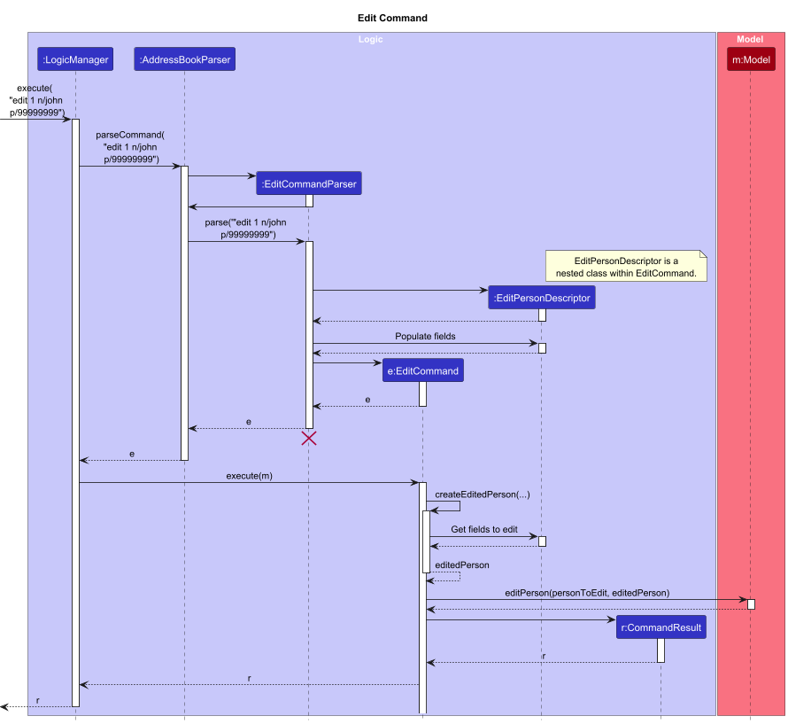


### Finding a person: `find`
The find command allows the user to search for persons whose fields match given keywords. In the implementation, there are two types of find operations that reuse the same predicate `find`.

1. Global find
Searches across all supported fields of a person and returns persons where any field matches the given substring

2. Field-specific filtered search
Searches only within specified fields and returns persons whose value in that field matches the given substring in that specific field.

This design allows the system to support both broad and targeted searching while keeping the matching logic reusable.

Examples:

* Global find: `find alex`
* Field-specific find: `find n/alex`
* Field-specific find: `find n/alex e/gmail`

A global find checks whether the substring appears in any searchable field, while a field-specific find restricts the search to the specified field only. Field-specific find will find contacts all within the displayed contact list that matches ANY of the keywords of specified fields.
For example, `find n/alex e/gmail` will find persons named 'alex' AND persons whose emails have a 'gmail' in it.

The find feature is implemented mainly using the following components:

* `FindCommand`
* `FindCommandParser`
* `PersonMatchesKeywordsPredicate`
* `ModelManager`

When the user enters a find command, `AddressBookParser` identifies the command and passes the input to `FindCommandParser`.

`FindCommandParser` determines which type of search the user is performing:

* If the user provides a plain keyword without a prefix, the parser interprets it as a global find.
* If the user provides a prefixed argument such as n/, p/, e/, or another supported prefix, the parser interprets it as a field-specific filtered search.

After parsing, the command creates a `PersonMatchesKeywordsPredicate`. Although both search modes use the same predicate class, the predicate is configured differently depending on the parsed input.

This predicate is then passed into a `FindCommand`, which updates the model’s filtered person list.

The following sequence diagram illustrates the flow of parsing and execution for the global `find` command.
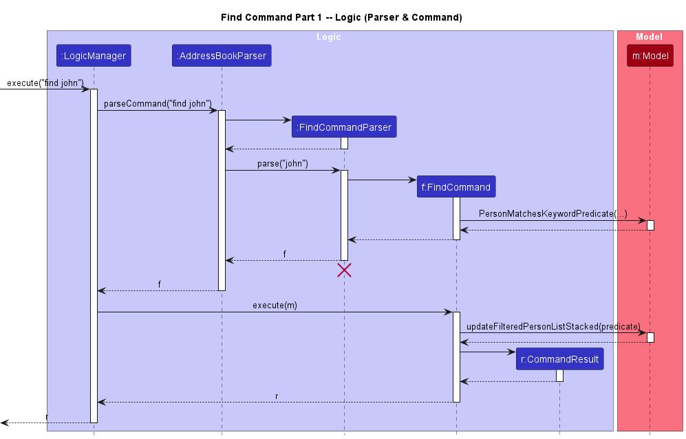
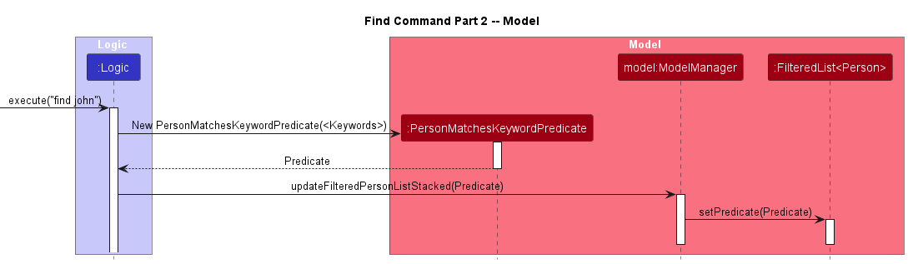


### Adding a tag: `addtag`

The `addtag` command is used to assign tags into one or more persons in the contacts list.
The index(es) (`INDEX [,INDEX...]`) and tags (`/TAG [/TAG...]`) must always be provided.

Input processing is performed by `AddTagCommandParser`, which tokenizes the user input and ensures that the following conditions are met:

- Preamble contains at least 1 index
- At least 1 tag is included in the command
- All field values are valid

Once the input is successfully parsed, an `AddTagCommand` instance is created with the set of tags to add and the indices of persons to add to.

The command checks the following conditions before continuing:

- If any of the indices are invalid
- If no tags are provided
- If all the tags specified (case-insensitive) already exist on all the people. 

When `AddTagCommand` is executed, for all the persons referred by the indices,
it edits their tags, and calls `Model#setPerson(person, personWithAddedTags)` to edit the address book.

<div style="page-break-after: always;"></div>

The following sequence diagram illustrates the flow of parsing and execution for the `addtag` command.

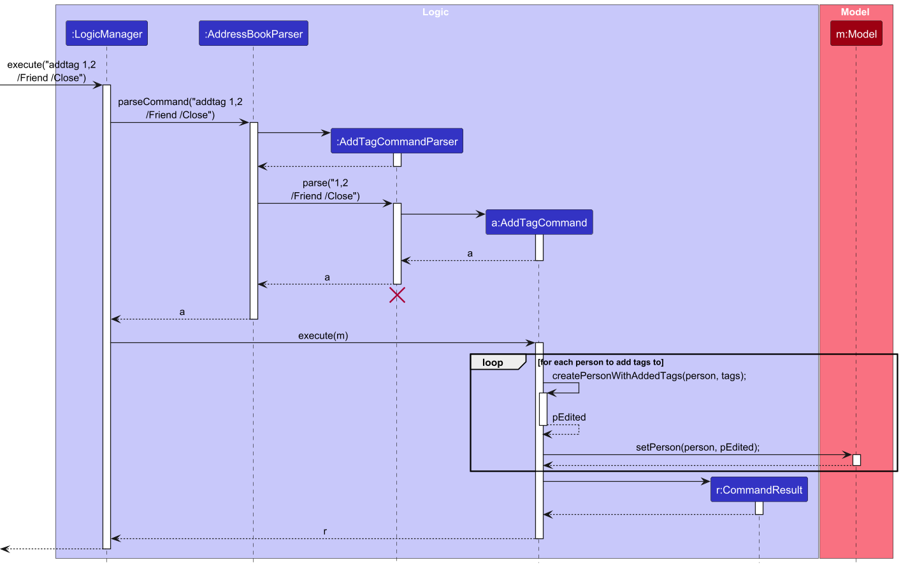


### Adding a meeting: `addmeet`

The `addmeet` command is used to add a meeting into the address book.
The meeting description (`d/DESCRIPTION`) and date (`dt/DATE`) must always be provided. Participant indices (`[INDEX,...]`) are optional.
The meeting can initially have no participants and edited later using `editmeet`.
For the purpose of a `Meeting`, a "participant" is defined as a `Person` whose ID is included in the `Meeting`.

Input processing is performed by `AddMeetingCommandParser`, which tokenizes the user input and ensures that the following conditions are met:

- Description field exists
- Date field exists
- All field values are valid

Once the input is successfully parsed, an `AddMeetingCommand` instance is created with the set of participant's indices.

Before the meeting is added, `Model#hasMeeting(Meeting)` will be called to ensure that the meeting has not already existed in the address book.
A meeting is considered a duplicate if it has the same description and date as another meeting.
**Participants alone do not differentiate two meetings**.

When `AddMeetingCommand` is executed, it gets the persons referred by the indices from the `Model`, and adds their IDs into the participant set.
It then calls `Model#addMeeting(Meeting)` to add the meeting to the address book.

<div style="page-break-after: always;"></div>

The following sequence diagram illustrates the flow of parsing and execution for the `addmeet` command.

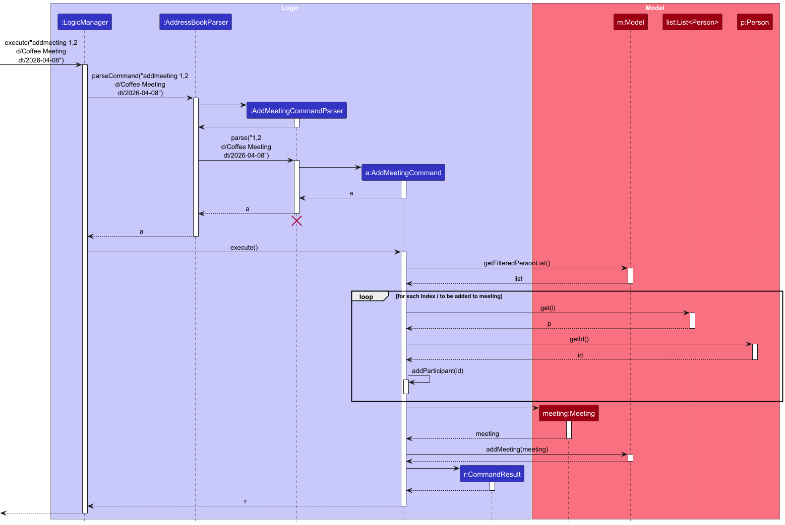

--------------------------------------------------------------------------------------------------------------------

<div style="page-break-after: always;"></div>


--------------------------------------------------------------------------------------------------------------------

## **Documentation, logging, testing, configuration, dev-ops**

* [Documentation guide](Documentation.md)
* [Testing guide](Testing.md)
* [Logging guide](Logging.md)
* [Configuration guide](Configuration.md)
* [DevOps guide](DevOps.md)

--------------------------------------------------------------------------------------------------------------------

### User stories

Priorities: High (must have) - `* * *`, Medium (nice to have) - `* *`, Low (unlikely to have) - `*`

| Priority | As a        | I want to                                                   | So that I can                                             |
|----------|-------------|-------------------------------------------------------------|-----------------------------------------------------------|
| `* * *`  | general user| add a new person to the contact list                        | store new contacts                                        |
| `* * *`  | general user| delete a person from the contact list                       | remove entries that I no longer need                      |
| `* * *`  | general user| list out all people in the contact list                     | see my saved contacts                                     |
| `* * *`  | general user| view a person’s profile in the contact list with full details| access comprehensive details when needed                 |
| `* * *`  | general user| edit information of people in the contact list              | keep my records accurate                                  |
| `* * *`  | general user| add a meeting with people in the contact list               | keep track of scheduled interactions                      |
| `* * *`  | general user| delete meetings with people in the contact list             | remove outdated or cancelled meetings                     |
| `* * *`  | general user| find people in the contact list by one or multiple tags     | locate people in specific categories                      |
| `* *`    | general user| find a person in the contact list by name                   | locate details without going through the entire list      |
| `* *`    | general user| find people in the contact list by phone or email           | locate contacts even without names                        |
| `* *`    | new user    | see usage instructions                                      | refer to instructions when I forget how to use the app    |
| `* *`    | general user| add tags to people in the contact list en masse             | categorise contacts efficiently                           |
| `* *`    | general user| delete tags from people in the contact list en masse        | keep tags up to date efficiently                          |
| `* *`    | general user| edit a tag for people in the contact list en masse          | maintain accurate categorisation efficiently              |
| `* *`    | general user| star or favourite people in the contact list                | access important contacts quickly                         |
| `* *`    | general user| unstar or remove favourite from people in the contact list  | keep priorities updated                                   |
| `* *`    | general user| edit meetings with people in the contact list               | keep meeting details up to date                           |
| `* *`    | general user| find meetings by date or description                        | locate specific meetings easily                           |
| `* *`    | general user| delete people in the contact list en masse                  | remove multiple entries efficiently                       |
| `* *`    | general user| see overdue follow-ups for people in the contact list       | remember to follow up                                     |
| `*`      | general user| sort people in the contact list lexicographically           | locate contacts more easily                               |
| `*`      | general user| sort meetings by date                                       | view meetings in chronological order                      |
| `*`      | general user| go to my last command quickly                               | fix mistakes faster                                       |

## Use Cases

For all use cases below, the **System** is **Internlink** and the **Actor** is the **User**.

---

**Use case: UC1 - Add a contact / meeting**

**MSS:**

1. User requests to add a new contact / meeting by providing details.
2. Internlink checks whether the contact / meeting already exists.
3. Internlink saves the contact / meeting.
4. Internlink updates the contact / meeting list.
5. Internlink reports the successful creation of contact / meeting.

Use case ends.

<div style="page-break-after: always;"></div>

**Extensions:**

* 2a. The contact / meeting already exists.
    * 2a1. Internlink notifies the user of the duplicate person / meeting error.

      Use case resumes at step 1.


* 5a. The meeting has a date that is before the device's time.
    * 5a1. Internlink reports the successful creation of contact / meeting, and notes the date has passed.

      Use case ends.


**Use case: UC2 - Delete contact(s) / meeting(s)**

**MSS:**

1. User requests to delete one or more contact(s) / meeting(s) by index.
2. Internlink identifies the specified contact(s) / meeting(s) in the current displayed list.
3. Internlink deletes the specified contact(s) / meeting(s).
4. Internlink updates the contact / meeting list.
5. Internlink reports the successful deletion of contact / meeting.

Use case ends.

**Extensions:**

* 2a. One or more of the specified indices has no contact / meeting.
    * 2a1. Internlink notifies the user of the invalid person / meeting index error.

      Use case resumes at step 1.


**Use case: UC3 - List contacts / meetings**

**MSS:**

1. User requests to list contacts / meetings.
2. Internlink retrieves all contacts / meetings.
3. Internlink displays the contact / meeting list.

Use case ends.

**Extensions:**

* 3a. There are no contacts / meetings stored.
    * 3a1. Internlink displays an empty list.

      Use case ends.

<div style="page-break-after: always;"></div>

**Use case: UC4 - Edit contact details**

**MSS:**

1. User requests to edit a contact by index, providing the updated contact details.
2. Internlink identifies the specified contact in the current displayed list.
3. Internlink checks whether the updated contact would duplicate an existing contact.
4. Internlink updates the contact.
5. Internlink reports the successful editing of contact.

Use case ends.

**Extensions:**

* 2a. The specified index has no contact.
    * 2a1. Internlink notifies the user of the invalid person index error.

      Use case resumes at step 1.


* 3a. The updated contact would duplicate an existing contact (same name, and same email or phone).
    * 3a1. InternLink notifies the user of the duplicate person error.

      Use case resumes at step 1.


* 4a. The edited contact does not match the current filters in place from `find` commands for the displayed contact list.
    * 4a1. The contact disappears from the displayed contact list.

      Use case resumes at step 5.

**Use case: UC5 - Edit a meeting**

**MSS:**

1. User requests to edit a meeting by index, providing the updated meeting details.
2. Internlink identifies the specified meeting in the current displayed meeting list.
3. Internlink identifies the specified contacts in the current displayed contact list.
4. Internlink checks whether the updated meeting would duplicate an existing meeting.
5. Internlink updates the meeting.
6. Internlink reports the successful editing of meeting.

Use case ends.

**Extensions:**

* 2a. The specified index has no meeting.
    * 2a1. Internlink notifies the user of the invalid meeting index error.

      Use case resumes at step 1.


* 3a. One or more specified participant indices has no contact.
    * 3a1. Internlink notifies the user of the invalid person index error.

      Use case resumes at step 1.


* 3b. One or more specified contacts are specified as added and deleted in the same command (e.g., `add/1 del/1`).
    * 3b1. InternLink specifies these contact indices, and reports them as illegal inputs for the command.

      Use case resumes at step 1.


* 4a. The updated meeting would duplicate an existing meeting (same description and date).
    * 4a1. Internlink notifies the user of the duplicate meeting error.

      Use case resumes at step 1.


* 5a. The edited meeting does not match the current filters in place from `find` commands for the displayed meeting list.
    * 5a1. The meeting disappears from the displayed meeting list.

      Use case resumes at step 6.


* 6a. The edited meeting has a date that is before the device's time.
    * 6a1. Internlink reports the successful editing of contact / meeting, and notes the date has passed.

      Use case ends.


**Use case: UC6 - Find contacts**

**MSS:**

1. User requests to find contacts and provides search input.
2. Internlink evaluates the current displayed contact list for contacts that have the input as substrings.
3. Internlink filters the displayed contact list to include only matching contacts.
4. Internlink displays the filtered list of contacts.
5. Internlink reports how many contacts are found.

Use case ends.

**Extensions:**

* 1a. User provides prefix-based input (e.g. `n/NAME`, `e/EMAIL`).
    * 1a1. Internlink restricts the search to the specified fields based on the provided prefixes.

      Use case resumes at step 2.

<div style="page-break-after: always;"></div>

* 1b. User provides keyword-based input (without prefixes).
    * 1b1. Internlink treats the entire input as a single substring that is searched in contacts' name, phone, and email.

      Use case resumes at step 2.


* 4a. No contacts in the displayed contact list match the search criteria.
    * 4a1. Internlink displays an empty contact list.

      Use case ends.

**Use case: UC7 - Find meetings**

**MSS:**

1. User requests to find meetings and provides search inputs (e.g. description, date, or participant indices).
2. Internlink evaluates the current meeting list based on the provided inputs:
    - If participant indices are provided, meetings containing all specified participants are considered matches.
    - If description or date prefixes are provided (e.g. `d/`, `dt/`), meetings whose specified fields contain the given substrings are considered matches.
3. Internlink filters the meeting list to include meetings that match any of the specified prefixes.
4. Internlink displays the filtered list of meetings.
5. Internlink reports how many meetings are found.

Use case ends.

**Extensions:**

* 2a. One or more specified participant indices has no contact.
    * 2a1. Internlink notifies the user of the invalid person index error.

      Use case resumes at step 1.


* 3a. A meeting does not satisfy any of the specified prefix conditions.
    * 3a1. Internlink excludes the meeting from the filtered meeting list.

      Use case resumes at step 4.


* 4a. No meetings in the displayed meeting list match the specified criteria.
    * 4a1. Internlink displays an empty meeting list.

      Use case ends.

<div style="page-break-after: always;"></div>

**Use case: UC8 - Assign tags to contacts**

**MSS:**

1. User requests to assign one or more tags to one or more contacts by index.
2. Internlink identifies the specified contact(s).
3. Internlink adds the specified tag(s) to the selected contact(s).
4. Internlink updates the contact list.
5. Internlink reports the attempted addition of all specified tags.

Use case ends.

**Extensions:**

* 2a. One or more specified indices has no contact.
    * 2a1. Internlink notifies the user of the invalid person index error.

      Use case resumes at step 1.


* 3a. One or more, but not all specified tags (case-insensitive) already exist on the selected contacts.
    * 3a1. InternLink ignores the duplicate tags and adds only new tags, if any.

      Use case resumes at step 4.


* 3b. All specified tags (case-insensitive) already exist on the selected contacts.
    * 3b1. InternLink notifies the user that all specified tags already exist on all contacts.

      Use case resumes at step 1.

**Use case: UC9 - Find contacts by tag**

**MSS:**

1. User requests to find contacts using one or more tag substrings (case-insensitive).
2. InternLink checks the current displayed contact list for contacts containing at least one of the specified tag substrings.
3. InternLink filters the contact list to show matching contacts.
4. InternLink displays the matching contacts.
5. Internlink reports all results match at least one of the given tag substrings.

Use case ends.

**Extensions:**

* 2a. None of the specified tags substrings exist in the displayed contact list.
    * 2a1. InternLink notifies the user that no matching tags were found.

      Use case resumes at step 1.

<div style="page-break-after: always;"></div>

* 2b. Some specified tag substrings are invalid.
    * 2b1. InternLink ignores the invalid tags and proceeds searching for valid ones.

      Use case resumes at step 3.

**Use case: UC10 - Delete tags from contacts**

**MSS:**

1. User requests to delete one or more tags (case-insensitive) from one or more contacts by index.
2. Internlink identifies the specified contact(s).
3. Internlink removes the specified tag(s) from the selected contact(s).
4. Internlink updates the contact list.
5. Internlink reports the attempted deletion of all specified tags.

Use case ends.

**Extensions:**

* 2a. One or more specified indices has no contact.
    * 2a1. Internlink notifies the user of the invalid person index error.

      Use case resumes at step 1.


* 3a. None of the specified tags exist on any of the selected contacts.
    * 3a1. Internlink notifies the user that the tags are not found.

      Use case resumes at step 1.


* 3b. Some specified tags do not exist on the selected contacts.
    * 3b1. Internlink ignores tags that are not present on the selected contacts and removes only applicable tags, if any.

      Use case resumes at step 4.

**Use case: UC11 - Star or unstar a contact**

**MSS:**

1. User requests to star or unstar a contact by contact indexes.
2. Internlink identifies the specified contacts.
3. Internlink updates the contact’s starred status (starred or unstarred).
4. Internlink updates the contact list.
5. Internlink reports attempt to star / unstar contacts.


Use case ends.

<div style="page-break-after: always;"></div>

**Extensions:**

* 2a. The specified index has no contact.
    * 2a1. Internlink notifies the user of the invalid person index error.

      Use case resumes at step 1.


* 2b. All specified contacts are already in the target state (starred / unstarred).
    * 2b1. Internlink notifies the user that all selected contacts are already starred / unstarred.

      Use case resumes at step 1.


* 2c. Only some specified contacts are already in the target state.
    * 2c1. Internlink ignores those contacts and updates only the valid ones.

      Use case resumes at step 3.

    
### Non-Functional Requirements

1. Should work on any _mainstream OS_ as long as it has Java `17` or above installed.
2. Should be able to hold up to 1000 contacts without a noticeable sluggishness in performance for typical usage.
3. A user with above average typing speed for regular English text (i.e. not code, not system admin commands) should be able to accomplish most of the tasks faster using commands than using the mouse.
4. Search and filtering operations (including multi-tag filtering) should complete within 1 second for up to 100 contacts.
5. The system should load the application within 2 seconds with 1000 total contacts and meetings.
6. Each contact should be able to support up to 20 tags.
7. The application should automatically save changes after every successful command.
8. The application should prevent data corruption even if the program closes unexpectedly.
9. The application should try to recover all non-corrupted lines in the event of a data corruption.

<div style="page-break-after: always;"></div>

### Glossary

* **Mainstream OS**: Windows, Linux, Unix, MacOS.

* **Contact**: A person stored in the contact list, representing an individual such as a friend, colleague, or acquaintance.

* **Participant**: A contact associated with a meeting. Participant cards can be seen under a meeting, representing the individuals involved in that meeting.

* **Tag**: A label assigned to a contact to categorize or organize them. Examples: `friends`, `cs`, `school`, `project`. A contact may have multiple tags.

* **Meeting**: An event scheduled in the application, which may involve zero or more contacts. Each meeting contains details such as a description and a date.

* **Contact List**: The collection of all contacts currently stored in the application.

* **Displayed Contact List**: The current filtered view of contacts shown to the user (e.g., after using `find` or `findtag`).

* **Meeting List**: The collection of all meetings stored in the application.

* **Displayed Meeting List**: The current filtered view of meetings shown to the user (e.g., after using `findmeet`).

* **Index**: A number assigned to each item in a displayed list (contacts or meetings), used to reference that item in commands.

* **Prefix**: A marker used in commands to indicate a specific field (e.g., `n/`, `p/`, `e/`, `t/`, `d/`, `dt/`).

--------------------------------------------------------------------------------------------------------------------

<div style="page-break-after: always;"></div>

--------------------------------------------------------------------------------------------------------------------

## **Appendix: Requirements**

### Product scope

**Target user profile**:

* has a need to manage a significant number of contacts
* frequently arranges meetings with people they know
* need to log interactions with contacts
* prefer desktop apps over other types
* can type fast
* prefers typing to mouse interactions
* is reasonably comfortable using CLI apps

**Value proposition**:
* **Productivity:** Enable users to easily manage their numerous relations in a fast, distraction-free CLI.
* **Organization:** Neatly organizes information like contacts, meetings, and interaction notes all in one place, with efficient filtering and retrieval.
* **Simplicity:** A lightweight app that avoids slow, feature-heavy GUIs. Runs directly in the terminal with minimal setup.
* **Privacy:** Fully local application. No risk of data leakage or delays from network issues.

**Not in our scope**:
* Internlink does not send emails or messages to the contacts.
* Internlink cannot automatically sync with LinkedIn or other platforms.
* Internlink cannot manage internship applications.

--------------------------------------------------------------------------------------------------------------------

<div style="page-break-after: always;"></div>

--------------------------------------------------------------------------------------------------------------------

## **Appendix: Effort**

### Overview

This project required a moderate to high level of effort. Compared to AB3, which manages only a single entity type (Person), adding an additional entity type of Meetings
required us to design and integrate a new set of features while ensuring compatibility with the existing system.

### Extending the Architecture

One major challenge was implementing support for multiple entity types within a structure originally designed for only one. This included:
- Designing and implementing a new Meeting entity
- Extending the model, logic, and storage components to support meetings
- Creating a separate UI view for meetings and enabling seamless switching between Contacts and Meetings

### Entity Relationships

Another key challenge was creating references between entities, specifically linking contacts to meetings. Meetings can involve multiple contacts, which required us to:
- Store and manage references to existing Person objects within Meeting objects, and ensure it remains consistent when contacts are edited or deleted
- Adapt the storage layer so that these relationships can be saved and reconstructed accurately from JSON

### Understanding and Adapting AB3

A further difficulty was understanding and adapting the internal architecture of AB3. Much of the effort involved reverse-engineering how entities are handled across layers (Model, Logic, Storage), especially:
- How data is parsed and validated
- How commands interact with the model
- How data is persisted in JSON format

We had to replicate and adapt these mechanisms for the new Meeting entity, including modifying the JSON storage structure (`InternlinkData.json`) to support multiple entity types while maintaining data integrity.


### Conclusion

Overall, while AB3 provided a strong foundation, the effort required to extend it into a multi-entity system with additional UI functionality was considerable. As a team of five, we worked collaboratively to design, implement, and refine the application to the best of our abilities.

---

<div style="page-break-after: always;"></div>

---

## **Appendix: Planned Enhancements**

**Team size: 5**

1. **Allow a user to remove a phone number or email**  
   Currently, the application does not support removing an existing phone number or email address from a contact once the phone number/email address has been added.

   For instance, if a contact is stored with the phone number `91234567` and the email address `johndoe@gmail.com`, there is currently no way to clear either field. Since the application only requires that at least one contact detail be present, this is a limitation of the current `edit` command.

   We propose enhancing the `edit` command to allow users to remove an optional phone number or email address, provided that the edited contact still retains at least one valid contact detail.


2. **Accept 3-16 digits phone numbers, but provide a warning if it is not exactly 8 digits**<br>
   The current phone number validation is overly restrictive, as it only accepts exactly 8-digit numbers and rejects common Singapore phone number formats such as `1234 5678`, `+65 1234 5678`, or `12345678(HP)`.

   Although these inputs are valid in real-world usage and do not affect the core functionality of the application, they are currently disallowed, which reduces usability and makes data entry less intuitive for users.

   We propose to make the parser more flexible by accepting all alphanumerical digits from 3 up to 16 characters in length. However, we will warn users if their phone number input does not contain an exact 8 digit number with the following warning:<br>
   `Phone number detected contains is not exactly 8 digits. Please verify that it is correct.`


3. **Allow flexible digit lengths for `YY-MM-DD` date input**  
   The current system only accepts dates strictly in the `YY-MM-DD` format, which can be inconvenient for users who may omit leading zeros. We plan to relax the input constraints to accept variants of this format while preserving the same year-month-day ordering to avoid ambiguity.

   The following formats will be supported:
   - `YY-M-D` (e.g., `26-4-5`)
   - `YY-M-DD` (e.g., `26-4-14`)
   - `YY-MM-D` (e.g., `26-04-5`)

   All accepted formats will be internally normalized and stored as `YY-MM-DD`.

   This enhancement will be implemented using regex-based validation and parsing logic within the `MeetingDate` class.

<div style="page-break-after: always;"></div>

4. **Make `edittag` command throw an error when the old and new tags are identical**  
   The current implementation of the `edittag` command does not treat replacing a tag with the same value as an invalid operation. As a result, if the old and new tags are identical (case-sensitive), the command may proceed without making any actual change, which can be misleading to users.

   We plan to introduce validation logic that detects this no-change case and returns the following error message:  
   `The new tag cannot be the same as the existing tag.`

5. **Make text displayed on the UI wrap properly for long text**  
   The current UI does not handle exceptionally long text such as names gracefully. When a contact name exceeds the available display width, it may be truncated with an ellipsis (`...`) instead of wrapping across multiple lines.

   This reduces readability and may prevent users from viewing the full contact name directly from the GUI.

   We propose refining the UI layout so that long text wraps properly within the available space while preserving alignment and visual consistency.


6. **Improve feedback for success messages across all search commands**  
   The current success message (e.g., “xxx persons/meetings listed!”) for `find`-related commands (e.g., `find`, `findtag`, `findmeet`) does not indicate what filters are being applied on the list.

   As a result, users may misinterpret the output, especially if they are unaware that consecutive filtering operations have been applied.

   We plan to enhance the feedback across all `find` commands to explicitly indicate the active filters. For example:  
   `Note: You are currently working on a filtered list. Active filters: <filter1>, <filter2>.`

   As all predicates for filtering both meetings and contacts can be obtained from `ModelManager`, a shared method can be implemented to retrieve all current predicates and include them in the output message.


7. **Make the `Invalid contact/meeting index` error messages state the indices that are invalid**  
   Currently, when one or more indices are invalid, a generic error message, like the one below, is shown for contacts:  
   `“The person index provided is invalid."` 
   
   A similar message is given for meetings.

   When multiple indices are provided, this does not indicate which specific index caused the failure, requiring users to manually identify the issue.

   We propose enhancing the error message to explicitly identify the invalid index or indices and indicate the valid index range within the displayed list. For example:  
   `Index 5 is out of bounds for the displayed contact list. Valid indices are 1 to 3.`

   This will be implemented as a shared validation method across both contact and meeting commands as the index parsing is shared between commands.


8. **Specify which prefixes are missing in error messages for missing required prefixes**  
   The current implementation returns a generic format-related error message when a required prefix is omitted, which does not clearly indicate which specific input is missing.

   As a result, users may have to infer the cause of the error from the command format.

   We plan to introduce more targeted error reporting so that missing required prefixes are explicitly identified. For example:  
   `Name field is missing. Please use n/ to input a name.`

   This will be implemented centrally through the `ArgumentMultimap` class to ensure consistent handling across all commands.


9. **Improve responsiveness of contacts view layout**  
   The current contacts view does not make efficient use of horizontal screen space on larger window sizes. In fullscreen mode, a significant portion of the right side remains unused.

   We plan to enhance the layout so that when sufficient horizontal space is available, the meetings view is displayed alongside the contacts list instead of requiring users to switch tabs. This removes the need to click the "Go to Meetings" or "Go to Contacts" buttons to swap views and allows both to be viewed simultaneously.


10. **Allow prefix patterns after a space within input values across all commands**  
    Currently, prefix patterns such as `n/` can appear at the start of an input value (e.g., `n/n/me` is accepted as the name `n/me`), but cannot appear later in the same value after a space. This is because any prefix-like pattern after a space is interpreted as the start of a new field.

    This restricts valid inputs such as `n/n/me n/me`, where the intended name is `n/me n/me`, but the second `n/` is parsed as a new prefix.

    We plan to enhance the parser to support escaped prefix patterns within input values. <br>For example: `n/n/me \n/me`

    The parser will treat escaped prefixes as literal text while continuing to recognise regular prefixes.

    This will be implemented centrally within the parsing logic (e.g., `ArgumentMultimap`) to ensure consistent behaviour across all commands.
--- 

<div style="page-break-after: always;"></div>

--- 

## **Appendix: Instructions for manual testing**

Given below are instructions to test the app manually.

<div markdown="span" class="alert alert-info"> 

> ❗ **Note:** These instructions only provide a starting point for testers to work on; testers are expected to do more *exploratory* testing.

</div>

### Launch and shutdown

1. Initial launch

   1. Download the jar file and copy into an empty folder.

   2. Double-click the jar file. <br>
       Expected: Shows the GUI with a set of sample contacts and meetings. The window size may not be optimum.

2. Saving window preferences

   1. Resize the window to an optimum size. Move the window to a different location. Close the window.

   2. Re-launch the app by double-clicking the jar file.<br>
       Expected: The most recent window size and location is retained.

---

### Getting started

1. Launch the application as seen above.


2. Use the help command: `help`
   Expected: A help message is displayed that provides a link to the user guide.

---

### Adding and managing contacts

1. Add a new contact with minimal required fields: `add n/Alice Tan p/91234567`
   Expected: A new contact named Alice Tan is added with the phone number shown.


2. Try adding a contact without a name: `add p/91234567`
   Expected: Error message indicating invalid command format.


3. Add another contact with tags: `add n/Bob Lee e/bob@example.com t/friend t/cs`
   Expected: Contact is added with email and tags.


4. Edit an existing contact: `edit 1 p/98765432 e/alice@new.com`
   Expected: Contact 1’s phone and email are updated.


5. Try editing without specifying any fields: `edit 1`
   Expected: Error message indicating that at least one field must be provided.

---

<div style="page-break-after: always;"></div>

---

### Working with tags and favourites

1. Add tags to multiple contacts: `addtag 1, 2 / friends / cs`
   Expected: Tags are added to both contacts.


2. Attempt to use an invalid index: `addtag 0 / friends`
   Expected: Error message indicating invalid index.


3. Rename a tag: `edittag 1, 2 o/cs n/computer science`
   Expected: Tag is updated for the specified contacts.


4. Try editing a tag without specifying the old tag: `edittag 1, 2 n/computer science`
   Expected: Error message indicating invalid command format.


5. Remove a tag: `deletetag 1 / friends`
   Expected: Tag is removed from contact 1.


6. Try an incorrectly formatted delete tag command: `deletetag / friends 1`
   Expected: Error message indicating invalid command format.


7. Mark a contact as starred: `star 2`
   Expected: Contact 2 is marked as starred.


8. Try starring with an invalid index: `star 0`
   Expected: Error message indicating invalid index.


9. Remove starred marking: `unstar 2`
   Expected: Contact 2 is no longer marked as starred.

---

### Searching and filtering contacts

1. List all contacts: `list`
   Expected: Full contact list is displayed.


2. Search for contacts globally: `find Alice`
   Expected: Contacts matching "Alice" are shown.


3. Try searching without a keyword: `find`
   Expected: Error message indicating invalid command format.


4. Restore the original list with `list`.


5. Search using specific fields: `find n/Alice p/9876`
   Expected: Contacts matching the name or phone are shown.


6. Try mixing global and field search: `find Alice n/Bob`
   Expected: Error message due to mixing types of searches.


7. Restore the original list with `list`.


8. Search by tags: `findtag / friends`
   Expected: Contacts with the tag are displayed.


9. Try searching without specifying tags: `findtag`
   Expected: Error message indicating invalid format.

---

<div style="page-break-after: always;"></div>

---

### Managing meetings

1. Click the tab to switch from the Contacts view to the Meetings view.


2. Create a meeting with contacts: `addmeet 1, 2 d/Project meeting dt/2026-05-26`
   Expected: Meeting is added with the given details.


3. Try using an invalid date format: `addmeet d/Project meeting dt/26-05-2026`
   Expected: Error message indicating invalid date format.


4. Edit the meeting: `editmeet 1 d/Updated meeting dt/2026-06-01`
   Expected: Meeting details are updated.


5. Try editing with an invalid date: `editmeet 1 dt/01-06-2026`
   Expected: Error message indicating invalid date format.


6. List all meetings: `listmeeting`
   Expected: All meetings are displayed.


7. Search for meetings: `findmeet d/updated`
   Expected: Matching meetings are shown.


8. Delete a meeting: `deletemeet 1`
   Expected: Meeting at index 1 is deleted.


9. Try deleting with an invalid index: `deletemeet 999`
    Expected: Error message indicating invalid meeting index.

---

### Cleaning up

1. Click the tab to switch from the Meetings view back to the Contacts view.


2. Delete a contact: `delete 1`
   Expected: Contact at index 1 is removed.


3. Try deleting with an invalid index: `delete 999`
   Expected: Error message indicating invalid person index.


4. Clear all data: `clear`
   Expected: All contacts and meetings are removed.


5. Exit the application: `exit`
   Expected: Application closes successfully.

---

### Saving data

#### Missing file test

1. Close the application.


2. Delete `data/InternlinkData.json`.


3. Re-launch the application.

Expected: The application starts with sample data and logs that the datafile is missing.

<div style="page-break-after: always;"></div>

4. Add a person: `add n/Alice Tan p/91234567`

Expected: The datafile will reappear at the same location with the sample data and the added person inside.

#### Corrupted file test

1. Close the application.


2. Open `data/InternlinkData.json` and introduce invalid JSON (e.g. remove a closing bracket).


3. Re-launch the application.

Expected: The application detects the corrupted file, clears all data, and starts with an empty dataset,
logging that the datafile cannot be read. The `data/InternlinkData.json` file should remain untouched until
a command is inputted in the application.
