Hello fellow students, welcome to Internlink's User Guide!

### Table of Contents
<!-- TOC -->
- [Introduction](#introduction)
- [What is Internlink?](#what-is-internlink)
  - [Who this guide is for](#who-this-guide-is-for)
- [Using this Guide](#using-this-guide)
- [Getting Started](#getting-started)
  - [1. Getting the correct Java version](#1-getting-the-correct-java-version)
  - [**Checking your Java version:**](#checking-your-java-version)
  - [2. Downloading Internlink](#2-downloading-internlink)
  - [3. Running Internlink](#3-running-internlink)
- [User Interface](#user-interface)
  - [Contacts View](#contacts-view)
  - [Meetings Page](#meetings-page)
- [Features](#features)
  - [Guide to Command Format](#guide-to-command-format)
  - [Notes about Command Format](#notes-about-command-format)
- [General features](#general-features)
  - [Viewing help : `help`](#viewing-help--help)
  - [Clearing all entries : `clear`](#clearing-all-entries--clear)
  - [Exiting the program : `exit`](#exiting-the-program--exit)
  - [Accessing previous commands using arrow keys](#accessing-previous-commands-using-arrow-keys)
- [Managing contact information](#managing-contact-information)
  - [Adding a contact : `add`](#adding-a-contact--add)
  - [Deleting a contact : `delete`](#deleting-a-contact--delete)
  - [Editing a contact : `edit`](#editing-a-contact--edit)
- [Mass-tagging features](#mass-tagging-features)
  - [Adding tags to one or more contacts : `addtag`](#adding-tags-to-one-or-more-contacts--addtag)
  - [Deleting tags from one or more contacts : `deletetag`](#deleting-tags-from-one-or-more-contacts--deletetag)
  - [Editing existing tags : `edittag`](#editing-existing-tags--edittag)
- [Using stars (favourites)](#using-stars-favourites)
  - [Starring contacts : `star`](#starring-contacts--star)
  - [Unstarring contacts : `unstar`](#unstarring-contacts--unstar)
- [Showing and finding contacts](#showing-and-finding-contacts)
  - [Listing all contacts : `list`](#listing-all-contacts--list)
  - [Finding contact information](#finding-contact-information)
  - [Locating contacts globally: global `find`](#locating-contacts-globally-global-find)
  - [Locating contacts by specific fields: field `find`](#locating-contacts-by-specific-fields-field-find)
  - [Finding contacts by tags : `findtag`](#finding-contacts-by-tags--findtag)
- [Managing meeting information](#managing-meeting-information)
  - [Adding a meeting : `addmeet`](#adding-a-meeting--addmeet)
  - [Deleting a meeting : `deletemeet`](#deleting-a-meeting--deletemeet)
  - [Editing a meeting : `editmeet`](#editing-a-meeting--editmeet)
- [Showing and finding meetings](#showing-and-finding-meetings)
  - [Listing all meetings : `listmeet`](#listing-all-meetings--listmeet)
  - [Finding a meeting : `findmeet`](#finding-a-meeting--findmeet)
- [Managing data](#managing-data)
  - [Saving the data](#saving-the-data)
  - [Editing the data file](#editing-the-data-file)
- [FAQ](#faq)
- [Known issues](#known-issues)
- [Command summary](#command-summary)
- [Glossary](#glossary)
<!-- TOC -->

------------------------------------------------------------------------------
## Introduction
Welcome to Internlink! This guide will help you get started.

## What is Internlink?
Internlink is a **contact management app** built with students in mind.
If you are an ambitious student seeking network opportunities in school, like internships, who frequently interact with people that have Singaporean phone numbers, this app is for you!

Internlink helps you to:
* Store and organize contact information and label them conveniently with tags
* Keep track of your numerous connections with people such as classmates, seniors, mentors, and industry contacts
* Track interactions and open up avenues for future academic and career aspects
* Manage upcoming meetings so you don’t miss any important opportunities

With Internlink, you can manage your network of personal and business relations in school with ease, and focus on striving to reach the top.

### Who this guide is for
This guide is written for students who have at least some experience with using a **Command Line Interface (CLI)** and are seeking networking opportunities during their time in school. Our goal is to get you quickly set up with the necessary requirements so you can breeze through the hassle and start using Internlink as soon as possible.

--------------------------------------------------------------------------------------------------------------------
## Using this Guide

<div markdown="block" class="alert alert-info">

**For Novice users**

* You can jump to the [Getting Started](#getting-started) section to get started on Internlink.
</div>

<div markdown="block" class="alert alert-success">

**For Experienced users**

* You can jump to the [Table of Contents](#table-of-contents) to start navigating the guide.
</div>

<div markdown="block" class="alert alert-warning">

**For Advanced users**

* You can jump to the [Command Summary](#command-summary) for a quick summary of all the commands and their formats.
</div>

[Back to Table of Contents](#table-of-contents)

—---------------------------------------------------------------------------------------------------------------------

## Getting Started
### 1. Getting the correct Java version
Internlink requires **Java 17** to run. Please follow the instructions according to your computer's operating system.


### **Checking your Java version:**
1. Open a command terminal  (search for “PowerShell” or “Terminal” on your computer).
2. Execute this command using the steps below: `java -version`.
> * Type `java -version` and press Enter
> * If Java is installed, you'll see the version number (e.g., `java version "17.0.1"`)
> * The first number before the first period (`.`) should be 17 or higher
>
**If Java is not installed or the version is below 17:**
> Download and install Java 17 by following the guides below:
> * [for Windows users](https://se-education.org/guides/tutorials/javaInstallationWindows.html)
> * [for Mac users](https://se-education.org/guides/tutorials/javaInstallationMac.html)
> * [for Linux users](https://se-education.org/guides/tutorials/javaInstallationLinux.html)


After installation, restart your terminal and verify the version again by repeating step 2.<br>
If installed correctly, when you [check your Java version again](#checking-your-java-version), you should see a Java version starting with `17` (e.g., `17.0.5`).

### 2. Downloading Internlink
Download the latest `Internlink.jar` file from [here](https://github.com/AY2526S2-CS2103T-T12-3/tp/releases).

### 3. Running Internlink
1. Create a new folder on your computer where you want to store the app and its data, and place `Internlink.jar` into this new folder.
2. Open a command terminal  (search for “PowerShell” or “Terminal” on your computer).
3. Navigate to the folder that you created (using `cd FILE_PATH`).
> 💡 **Tip:** If you have difficulty navigating in the terminal, type “cd ”, then drag the folder into the terminal window. Pressing Enter will automatically navigate to that folder (this works on most systems)!
4. Type `java -jar Internlink.jar` in the terminal and press Enter.
5. An application window should appear in a few seconds similar to the one below. Note how the app already contains some sample data.
   

Congratulations! You are now ready to use Internlink. Refer to the [Features](#features) below for details of each command.


Alternatively, to get started, you can try out some of the suggested commands here.


* `list` : Lists all contacts.

* `add n/John Doe p/98765432 e/johnd@example.com` : Adds a contact named John Doe to the contact list, with phone number `98765432` and email `johnd@example.com`.

* `addmeet 1,2,3 d/Project meeting dt/2026-04-10` : Creates a meeting titled "Project meeting" on 10 April 2026 with the persons at index 1, 2, and 3 as participants.

* `delete 1` : Deletes the 1st contact shown in the displayed contact list. This will also delete the person from all meetings they were a part of.

* `clear` : Deletes all contacts.

* `exit` : Exits the app.

[Back to Table of Contents](#table-of-contents)


--------------------------------------------------------------------------------------------------------------------

## User Interface
> ⚠️ **Caution:** Reducing the window size may affect the display of information.

### Contacts View
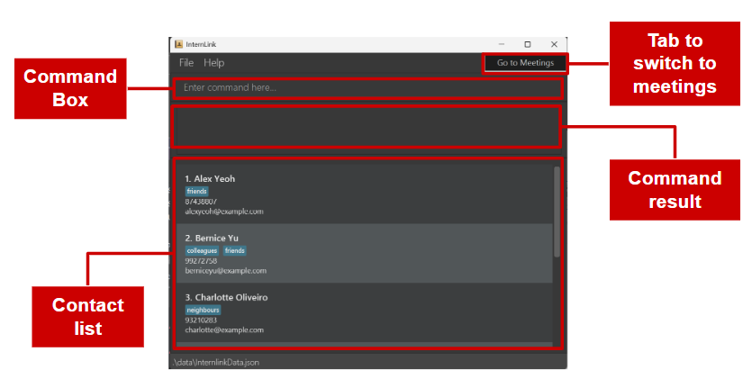

| Component              | Description                                         |
|------------------------|-----------------------------------------------------|
| Command Box            | Used to enter commands                              |
| Command Result Display | Shows feedback or results after executing a command |
| Contact List           | Displays contacts with indices for easy reference   |
| Tab Button             | Switches to the Meetings Page                       |

### Meetings Page
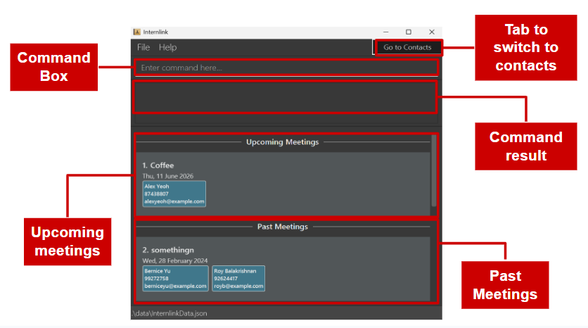

| Component              | Description                                            |
|------------------------|--------------------------------------------------------|
| Command Box            | Used to input meeting-related commands                 |
| Command Result Display | Displays confirmation or error messages                |
| Upcoming Meetings      | Lists all future meetings with associated participants |
| Past Meetings          | Lists meetings that have already occurred              |
| Tab Button             | Switches back to the Contacts Page                     |

---

> 💡 **Tip:** Need to use a command that references both meetings and contacts?
Don’t worry — the command box is not cleared when switching between pages, so you
 can switch as many times as needed while entering your command.
>
[Back to Table of Contents](#table-of-contents)

## Features

### Guide to Command Format
The command format consists of three main parts:

| Component    | Example       | Description                                     |
|--------------|---------------|-------------------------------------------------|
| Command Word | `find`        | Specifies the action to perform                 |
| Prefix       | `n/`          | Indicates which field is being set (e.g., name) |
| Parameter    | `George Best` | The value provided by the user                  |

For example, `find n/George Best` is a valid command formed using these three components.

> ❗ **Note:** Some parameters may not be accompanied by a prefix. For example, in `addtag`, the `INDEX` parameter is inputted right after the command word. Additionally, `/` (which tends to appear in [tag-related commands](#mass-tagging-features)) is also considered a prefix. <br> <br>
> Not all commands strictly follow the Command Word → Prefix → Parameter format exactly.

[Back to Table of Contents](#table-of-contents)

### Notes about Command Format
> ❗ **Note:** If you get confused about the terms being used at any point, feel free to refer back to the [Guide to Command Format](#guide-to-command-format) section above to get a better understanding.

* Words in `UPPER_CASE` represent parameters.<br>
  e.g. `add n/NAME`, `NAME` should be replaced with the desired value. `add n/John Doe` adds a contact named `John Doe`.

* Prefixes/parameters in square brackets are optional.<br>
  e.g. `n/NAME [t/TAG]` can be used as `n/John Doe t/friend` or as `n/John Doe`.

* If a command has certain prefixes/parameters in round brackets, you must provide at minimum one of the bracketed parameters for the command to succeed.<br>
  e.g. for `add`, (p/PHONE_NUMBER) (e/EMAIL) means that at least a phone number OR an email must be provided.

* Text followed by `…` can be used zero or more times (or **one or more times if the parameter is not optional**).
  e.g. `[t/TAG]…` can be ignored entirely, or used as `t/friend`, `t/friend t/family`, etc.

* Parameters **that come with prefixes** can be inputted in any order.<br>
  e.g. `n/NAME p/PHONE_NUMBER` and `p/PHONE_NUMBER n/NAME` are the same.<br> However, in the case of `deletetag`, the positions of indices and tags cannot be swapped.

* Commands without parameters (e.g. `help`, `list`, `exit`, `clear`) ignore any additional text after the command word.
  e.g. `help 123` is treated as `help`.

* In all commands that can take in multiple indices, indices are to be separated by commas, except for after the final index.
  e.g. for `addtag`, if you want to add a tag to contacts 1, 2 and 3, `addtag 1, 2, 3 / friends` is a valid command.

* If you are using a PDF version of this document, be careful when copying and pasting multi-line commands, as spaces surrounding line-breaks may be left out when copying over to the application.

> ❗ **Note:** In the feature sections below, **"displayed contact list"** refers to the contact list in its current state (whether full or filtered via commands like `find` and `findtag`), while **"entire contact list"** always refers to the full unfiltered list. You may refer to their definitions easily through the [glossary](#glossary)!

[Back to Table of Contents](#table-of-contents)

## General features

### Viewing help : `help`

**Format:**
```
help
```

**Description:** You can use this command to display a message explaining how to access the help page.


[Back to Table of Contents](#table-of-contents)

### Clearing all entries : `clear`

**Format:**
```
clear
```

**Description:** You can use this command to clear all entries from Internlink's data (both contacts and meetings).

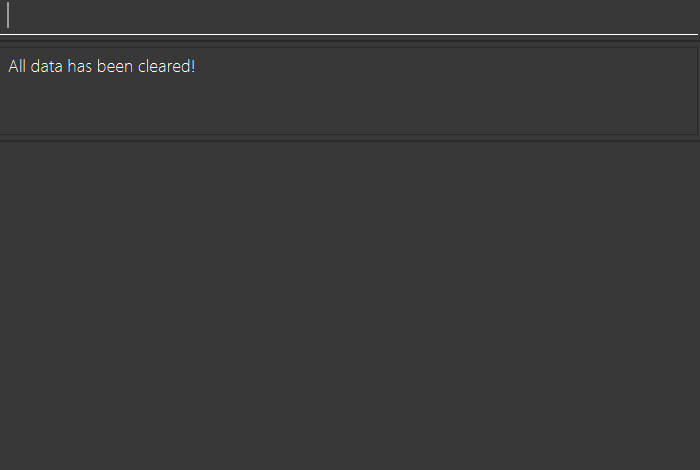


> ⚠️ **Warning:** This action is irreversible. All entries will be permanently deleted, and there is no way to undo this command.

[Back to Table of Contents](#table-of-contents)

### Exiting the program : `exit`

**Format:**
```
exit
```

**Description:** You can use this command to exit Internlink.

> ❗ **Note:** Worried about losing your data? Don’t worry — all changes are automatically saved after every edit.

[Back to Table of Contents](#table-of-contents)

### Accessing previous commands using arrow keys

When typing your command, you can use **up** and **down** arrows to shift through previous commands that you have entered.

Usage:
* **Up** arrow: Previous command
* **Down** arrow: Next command

> 💡 **Tip:** Need to make some updates to your contact list? Use the arrow keys to reuse previous commands and save time!

[Back to Table of Contents](#table-of-contents)

## Managing contact information

> ❗ **Note:** Internlink does not allow duplicate contacts. A contact is considered a duplicate only if the *name and (phone number OR email)* match an existing entry.<br><br> 
> Additionally, checks for name and email are *case-insensitive* (e.g. `John Doe` and `john doe` are considered the same name).<br><br>
> If you try to create a duplicate contact, the following error message will be shown in the command result box:<br>
> `A person with the same name (case-insensitive), phone number, and email (case-insensitive) already exists.`<br>
`Note: For name, leading/trailing spaces are ignored, but internal spacing differences are considered distinct. (e.g "John Doe" and "John  Doe" are considered different.)`

> ❗ **Note:** If a command requires an INDEX, but is given one that does not correspond to an existing contact’s index in the list, the following error message will be shown in the command result box:
> `The person index provided is invalid`.

> 💡 **Tip:** A comprehensive description of the specific limitations and requirements of the `NAME`, `PHONE` and `EMAIL` parameters are described in the [glossary](#glossary). 
### Adding a contact : `add`

**Format:**
```
add n/NAME (p/PHONE_NUMBER) (e/EMAIL) [t/TAG]...
```

**Description:** You can use this command to add a new contact to your contact list. The details of the given contact can also be seen in the command result box once they have been added.

An added contact is automatically be sorted into your list by alphabetical order.

Try `add n/Betsy Crowe p/12345678 e/betsycrowe@example.com t/friend t/criminal` <br>
Output: <br>
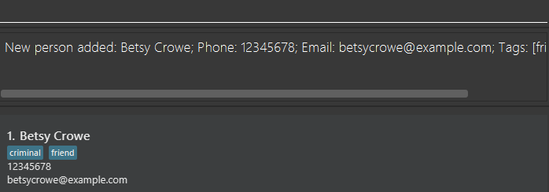

> 💡 **Tip:** In a rush? Just provide a *name* and *one other contact detail* (phone number/email) to add the contact. You can fill in the rest later with the [`edit` command](#editing-a-contact--edit)

> 💡 **Tip:** Confused about the difference between `( )` and `[ ]` in the command? Refer to the [Notes about Command Format](#notes-about-command-format) section for a detailed explanation.

**Examples:**
- `add n/John Doe e/johndoe@example.com` adds a new contact with name `John Doe` and email `johndoe@example.com`.
- `add n/Betsy Crowe p/12345678 e/betsycrowe@example.com t/friend t/criminal` adds a new contact with name `Betsy Crowe`, phone number `12345678`, email `betsycrowe@example.com` and tags `friend` and `criminal`.

> 💡 **Tip:** Added a key contact and want to quickly spot them in your list? Use the [`star` command](#starring-contacts--star) to mark them as favourites and bring them to the top.

[Back to Table of Contents](#table-of-contents)

### Deleting a contact : `delete`
> 💡 **Tip:** The examples below for `delete` use the [`find`](#locating-contacts-globally-global-find) and [`list`](#listing-all-contacts--list) commands as well. Click on each of the two command in the previous sentence to be brought to their respective section!

**Format:**
```
delete INDEX [,INDEX]...
```

**Description:** You can use this command to delete the contact at the specified `INDEX` number(s) from the displayed contact list.
The details of the deleted contact(s) can also be seen in the command result box once completed.
Deleted persons will also be removed from meetings that they were a part of.

Try `delete 1` <br>
Output: <br>
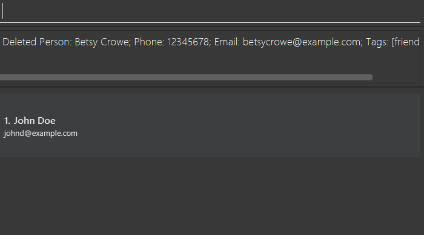

**Examples:**
* `list` followed by `delete 2, 3` deletes the 2nd and 3rd contacts in the displayed contact list.
* `find Betsy` followed by `delete 1` deletes the 1st contact in the result list of the `find` command.

[Back to Table of Contents](#table-of-contents)

### Editing a contact : `edit`

**Format:**
```
edit INDEX (n/NAME) (p/PHONE) (e/EMAIL) (t/TAG)…
```

**Description:** You can use this command to edit the contact at the specified `INDEX` in the displayed contact list with all the new information given. The details of the edited contact can also be seen in the command result box once completed.

Try `edit 1 p/91234567 e/johndoe@example.com` <br>
Output: <br>
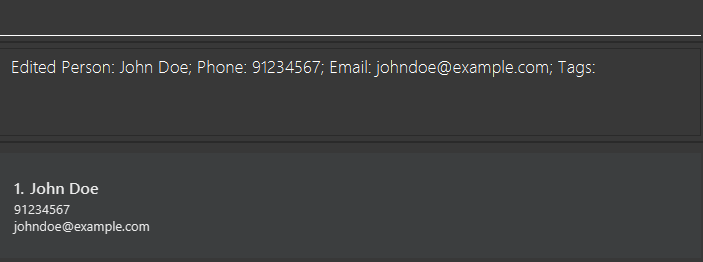

* At least one of the optional fields must be provided.
* When editing tags, adding of tags is not cumulative. You must input all existing tags of the contact if you want to keep them after editing.

> 💡 **Tip:** Need to remove all tags from a contact at once? Use `t/` without specifying any tags to do so.

> 💡 **Tip:** Confused about the difference between `( )` and `[ ]` in the command? Refer to the [Notes about Command Format](#notes-about-command-format) section for a detailed explanation.

**Examples:**
*  `edit 1 p/91234567 e/johndoe@example.com` edits the phone number and email of the 1st contact to be `91234567` and `johndoe@example.com` respectively.
*  `edit 2 n/Betsy Crower t/` edits the name of the 2nd contact to be `Betsy Crower` and clears all existing tags.

[Back to Table of Contents](#table-of-contents)

## Mass-tagging features
> 💡 **Tip:** Recently joined a group with people who are already in your contact list? Perhaps consider using these next few commands to make updating your contacts easier.

Internlink introduces 3 new tag-related functions that all allow operation on one or more contacts at once.

### Adding tags to one or more contacts : `addtag`

**Format:**
```
addtag INDEX [,INDEX]... /TAG [/TAG]...
```

**Description:** You can use this command to add the specified `TAG`s to the contacts at the specified `INDEX` numbers in the displayed contact list. It supports multi-index and multi-tag input, letting you add multiple tags to multiple people in a single command.

Try `addtag 1 /cs /friends` <br>
Output: <br>
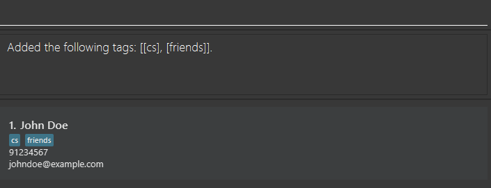

**Examples:**
* `addtag 5 /classmates` adds the `classmates` tag to contact index 5.
* `addtag 1,2,3 /friends /cs` adds the `friends` and `cs` tags to contact indices 1, 2 and 3.

> ❗ **Note:** If a `TAG` already exist for a contact, that `TAG` will not be duplicated.

[Back to Table of Contents](#table-of-contents)

### Deleting tags from one or more contacts : `deletetag`

**Format:**
```
deletetag INDEX [,INDEX]...  /TAG [/TAG]...
```

**Description:** You can use this command to delete the specified `TAG`s from the contacts at the specified `INDEX` numbers in the **displayed contact list**.  It supports multi-index and multi-tag input, letting you delete multiple tags from multiple people in a single command.

Try `deletetag 1 /cs /friends` <br>
Output: <br>
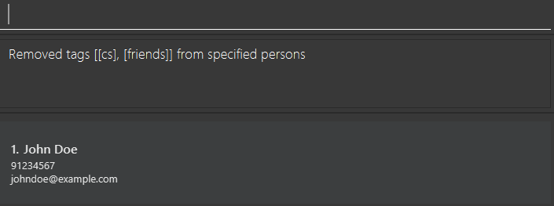

> ❗ **Note:** At least one of the `TAG`s must be already tagged on one of the specified contacts, otherwise the command will fail. Invalid tags will be ignored.

**Examples:**
* `deletetag 5 /classmates` deletes the `classmates` tag from contact index 5.
* `deletetag 1,2,3 /friends /cs` deletes the `friends` and `cs` tags from contact indices 1, 2 and 3.

[Back to Table of Contents](#table-of-contents)

### Editing existing tags : `edittag`

**Format:**

**Edit tags (selected contacts):**
```
edittag INDEX [,INDEX]... o/OLD_TAG n/NEW_TAG
```

**Edit tag (all contacts):**
```
edittag all o/OLD_TAG n/NEW_TAG
```

**Description:** You can use this command to edit the specified existing/old tag for the specified contacts at the specified `INDEX` numbers in the **displayed contact list** to the given new tag, or for all contacts in the displayed list in the case of `all`.

>💡 **Tip:** Made a typo in a tag? Use `all` in this command to rename it for every contact it's added to.

Try `edittag 1 o/cs n/computer science` <br>
Output: <br>
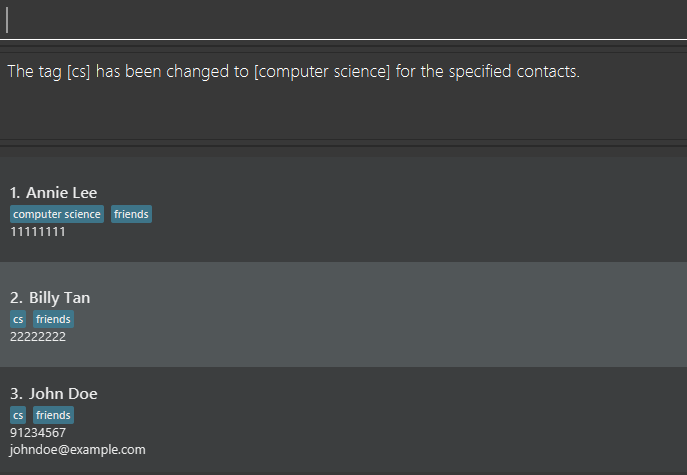

Try `edittag all o/friends n/classmates` <br>
Output: <br>
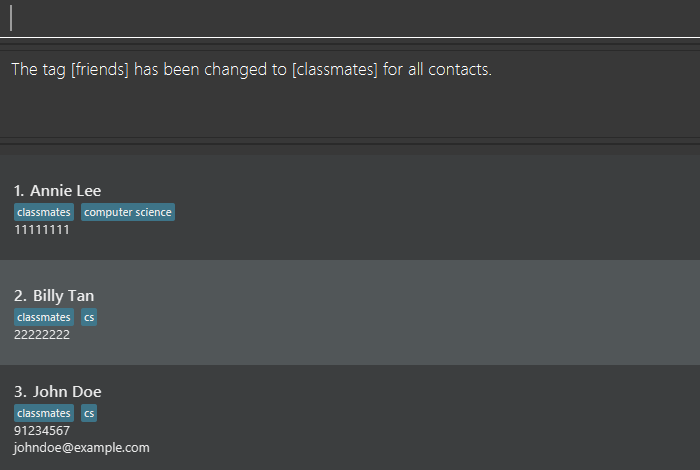

> ❗ **Note:** As long as one of the specified contacts has the given `OLDTAG`, the command will be recognized as valid.
Contacts without the `OLDTAG` will be ignored.

**Examples:**
* `edittag 1,2,3 o/cs n/computer science` edits the tag `cs` for contacts 1, 2 and 3, and changes it to `computer science`.
* `edittag all o/cs n/computer science` edits the tag `cs` for all contacts in the displayed contact list, and changes it to `computer science`.

[Back to Table of Contents](#table-of-contents)


## Using stars (favourites)

You can mark important contacts as favourites to easily identify and have them always appear at the top of your contact list.
This is especially useful for keeping track of frequently contacted people or high-priority connections.

> 💡 **Tip:** In the examples, `star` and `unstar` are used together with the [`find` command](#locating-contacts-globally-global-find) to make looking for specific contacts to star easier.

> 💡 **Tip:** The `STAR` (case-sensitive) label used in `star` and `unstar` is actually a tag with the name `STAR`. As such, contacts can also be starred/unstarred using [tagging features](#mass-tagging-features) such as `addtag` and `deletetag`!

### Starring contacts : `star`

**Format:**
```
star INDEX [,INDEX]...
```

**Description:** You can use this command to star/favourite the contact(s) at the specified `INDEX` number(s) in the displayed contact list by adding the `STAR` label to them.

Try `star 2` <br>
Output: <br>
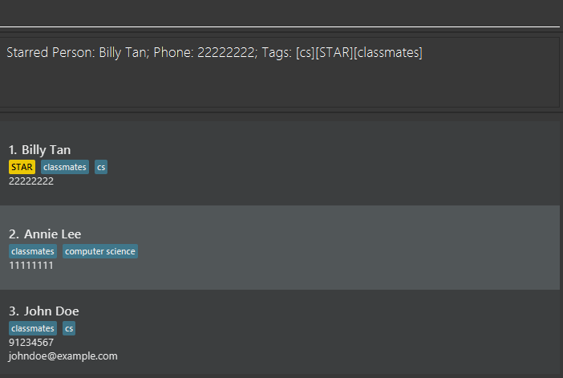

**Examples:**
* `list` followed by `star 2` stars the 2nd contact in the whole contact list (as `list` resets the list to the full one).
* `find Betsy` followed by `star 1` stars the 1st contact in the displayed contact list after the `find` command.

[Back to Table of Contents](#table-of-contents)

### Unstarring contacts : `unstar`

**Format:**
```
unstar INDEX [,INDEX]...
```

**Description:** You can use this command to unstar/unfavourite the contact(s) at the specified `INDEX` number(s) in the displayed contact list by removing the `STAR` label from them.

Try `unstar 1` <br>
Output: <br>
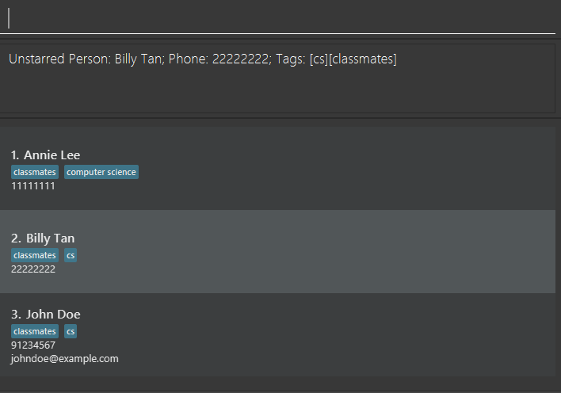

**Examples:**
* `list` followed by `unstar 2` unstars the 2nd contact in the whole contact list.
* `find Betsy` followed by `unstar 1` unstars the 1st contact in the displayed contact list after the `find` command.

[Back to Table of Contents](#table-of-contents)

## Showing and finding contacts

### Listing all contacts : `list`

**Format:**
```
list
```

**Description:** You can use this command to show the entire contact list that is stored in Internlink's data.

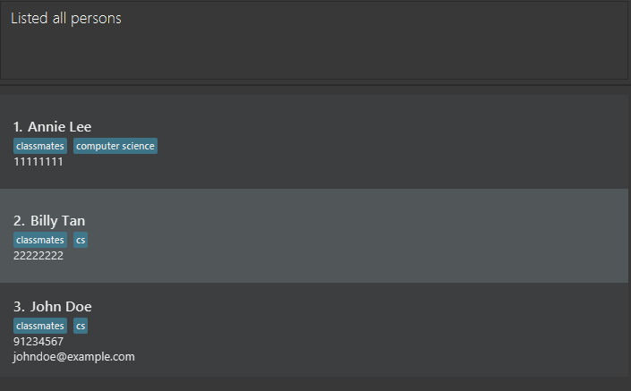

> 💡 **Tip:** This command is a convenient (and the only) way to clear all current filters (from `find` and `findtag`) and obtain the full contact list quickly.

[Back to Table of Contents](#table-of-contents)

### Finding contact information

> ❗ **Note:** The `find` (both global and field versions) and `findtag` commands operate on the **displayed contact list**, meaning their filters stack.<br>
> For example, if you input `find alex`, immediately followed by `findtag / friends`, the resulting list will be showing all contacts matching the global find on the `alex` keyword, and that also have the `friends` tag.


### Locating contacts globally: global `find`

**Format:**
```
find SEARCH SUBSTRING
```

> 💡 **Tip:** Unsure of what `SUBSTRING` means? Check out its definition in the [glossary](#glossary)!

**Description:** You can use this command to search the displayed contact list using all fields except tags (name, phone, email) to match with the given keyword.

Try `find billy` <br>
Output: <br>


* Search keywords are **not separated by spaces**. e.g. `find alex john` searches for `alex john` as a combined keyword.
* The search is case-insensitive. e.g. `hans` will match `Hans`

**Example:**
* `find John` returns `john` and `John Doe` in all fields except tags (name, email, phone).
* `find Bernice Yu` returns `Bernice Yu` in all fields except tags, but does not return `Yu` assuming that is an existing contact in the list.

> 💡 **Tip:** Global find’s functionality is stringent, but an easy way to do searches for different terms separately is to use the `list` command in between searches to reset the contact list back to the full one. e.g. `find alex` → `list` → `find john`
> 💡 **Tip:** If you're looking to find out how to find `alex` and `john` separately as specific fields (e.g. names), visit the field `find` section right below!

[Back to Table of Contents](#table-of-contents)

### Locating contacts by specific fields: field `find`

**Format:**
```
find (n/NAME)... (p/PHONE)... (e/EMAIL)...
```

**Description:** You can use this command to search the displayed contact list using specific fields except tags (name, phone, email) and only search within that field. However, **field find cannot be used with global find concurrently.**

Try `find p/1` <br>
Output: <br>


* To search for multiple keywords in the same field, you must enter the prefix before each keyword. This is because field find treats the entire input after the prefix as a single search keyword, similar to global find.
  e.g. If you want to search for either `alex` or `billy` in the name field, you must do `find n/ alex n/ billy`. Doing `find n/ alex billy` will search for `alex billy` as a combined keyword in the name field, similar to how global find operates with spaces.

**Example:**
* `find n/ david p/ 9927 e/ charlotte` filters all contacts whose name contains `david` OR whose phone number contains `9927` OR whose email contains `charlotte`.

[Back to Table of Contents](#table-of-contents)

### Finding contacts by tags : `findtag`

**Format:**
```
findtag /TAG SUBSTRING [/TAG SUBSTRING]...
```

> 💡 **Tip:** Unsure of what `SUBSTRING` means? Check out its definition in the [glossary](#glossary)!

**Description:** You can use this command to find contacts with specific tag substrings, for easier management.

Try `findtag /classmates /cs` <br>
Output: <br>


* `findtag` operates on the **displayed contact list**.
* All contacts containing **at least one** of the given tag substrings will be filtered (i.e. `OR` search).
* As long as one of the given tag substrings exist in the displayed contact list, `findtag` will successfully execute. Invalid tag substrings will be ignored.
* `findtag` is case-insensitive.

**Examples:**
* `findtag /classmate` filters all contacts that contain the `classmates` tag, since `classmates` contains the word `classmate` in it.
* `findtag /schoolB /schoolC` filters all contacts that contain at least one of the `schoolB` or `schoolC` tags, or any other relevant tags that contain `schoolB` or `schoolC`.

[Back to Table of Contents](#table-of-contents)

## Managing meeting information
> ❗ **Note:** Internlink does not allow duplicate meetings. A meeting is considered a duplicate only if the *description and date* both match an existing entry.
> If you try to create a duplicate meeting, the following error message will be shown in the command result box:
> `This meeting already exists in the address book`.

> ❗ **Note:** If a command requires a `MEETING_INDEX`, but is given one that does not correspond to an existing meeting’s index in the list, the following error message will be shown in the command result box:
> `Invalid meeting index provided: MEETING_INDEX`.

### Adding a meeting : `addmeet`

**Format:**
```
addmeet [CONTACT_INDEX] [,CONTACT_INDEX]... d/DESCRIPTION dt/DATE
```

**Description:** You can use this command to schedule and add a meeting with zero or more people based on their indices shown in the displayed contact list. This command will also show the details of the meeting scheduled in the command result panel.

Try `addmeet 1,2 d/Casual Icebreaker dt/2026-05-26` <br>
Output: <br>


> ❗ **Note:** DATE must be in the `YYYY-MM-DD` format (e.g. `2024-03-15`).

> 💡 **Tip:** If you can’t find a contact, use the [`find` command](#locating-contacts-globally-global-find) to filter the list. This will update the indices based on the results.

**Examples:**
* `addmeet 1,2 d/Casual Icebreaker dt/2026-03-26` schedules a meeting with description `Casual icebreaker` and date `2026-03-26`, with the first 2 contacts in the displayed contact list.
* `addmeet d/Casual Icebreaker dt/2026-03-26` schedules a meeting with description `Casual icebreaker` and date `2026-03-26`, with no people.

> 💡 **Tip:** Not sure who is attending the meeting yet?
> You can create the meeting in advance without adding any participants and update it later with the [`editmeet` command](#editing-a-meeting--editmeet).

[Back to Table of Contents](#table-of-contents)

### Deleting a meeting : `deletemeet`

**Format:**
```
deletemeet MEETING_INDEX [,MEETING_INDEX]...
```

**Description:** You can use this command to delete meetings based on their index shown in the displayed meeting list. This command will also show the details of the meetings deleted in the command result panel.

Try `deletemeet 1` <br>
Output: <br>


**Examples:**
* `deletemeet 1` deletes the meeting with index 1 in the displayed meeting list
* `deletemeet 2,3` deletes the meetings with indices 2 and 3 in the displayed meeting list

> 💡 **Tip:** Need to delete multiple meetings with similar traits? Use the [`findmeet` command](#finding-a-meeting--findmeet) to filter the list — this groups them together and updates their indices, making it easy to delete them.

[Back to Table of Contents](#table-of-contents)

### Editing a meeting : `editmeet`

Format:
```
editmeet MEETING_INDEX (d/DESCRIPTION) (dt/DATE) (add/CONTACT_INDEX [,CONTACT_INDEX]...) (del/CONTACT_INDEX [,CONTACT_INDEX]...)
```

**Description:** You can use this command to edit a meeting’s details (e.g. description, date, contacts involved) based on its index in the displayed meeting list. The updated meeting details will be shown in the command result panel.

Try `editmeet 1 d/Casual icebreaker add/5 del/1` <br>
Output: <br>


> ❗ **Note:** DATE must be in the `YYYY-MM-DD` format (e.g. `2024-03-15`).

> ⚠️ **Warning:** No warning is shown when adding a participant who is already in the meeting.
> - Additions are processed before deletions.
> - If a participant is **already in the meeting** and their INDEX appears in both `add/` and `del/`, they will be **removed**.
> - If a participant is **not in the meeting** and their INDEX appears in both `add/` and `del/`, that person will **not be added** to the meeting.

> 💡 **Tip:** Confused about the difference between `( )` and `[ ]` in the command? Refer to the [Notes about Command Format](#notes-about-command-format) section for a detailed explanation.

**Examples:**
* `editmeet 2 dt/2026-05-01 d/Project meeting` edits the meeting at index `2` in the displayed meeting list, changing the description to `Project meeting` and date to `2026-05-01`.
* `editmeet 1 d/Casual icebreaker add/5 del/1`
    - Edits the meeting at index `1` in the displayed meeting list
    - Updates the description to `Casual icebreaker`
    - Adds the contact at index `5` in the **displayed contact list**
    - Removes the contact at index `1` in the **displayed contact list**

> 💡 **Tip:** Need to add multiple participants with similar traits? Use the [`find` command](#locating-contacts-globally-global-find) to filter the contact list — this groups them together and updates their indices, making it easier to reference and add them.
>
[Back to Table of Contents](#table-of-contents)

## Showing and finding meetings

### Listing all meetings : `listmeet`

**Format:**
```
listmeet
```

**Description:** You can use this command to show the entire meeting list that is stored in Internlink's data.


> 💡 **Tip:** Similar to `list`, this command is essential to clearing all current filters and obtain the full meeting list.

[Back to Table of Contents](#table-of-contents)

### Finding a meeting : `findmeet`

**Format:**
```
findmeet (d/DESCRIPTION) (dt/DATE) (i/CONTACT_INDEX [,CONTACT_INDEX]...)
```

**Description:** You can use this command to find meetings that match the given substrings in their fields. The displayed meeting list will be filtered to show only meetings that match the given criteria.

Try `findmeet d/casual` <br>
Output: <br>


> ❗ **Note:** Date should be in YYYY-MM-DD format (e.g. `2024-03-15`) but the search keyword need not be a complete date (i.e. something like YYYY-MM is still valid). This is because dates for meetings are stored in the YYYY-MM-DD format, so keep that in mind if inputting the search keyword for it.

> ❗ **Note:** Meetings including **all specified contact indices within a single `i/`** will be matched.

* Meetings are shown if they match **DESCRIPTION**, **DATE**, or  include **all specified indices within a single `i/`**.
* Search parameters are case-insensitive.
* The contact indices refer to indices from the **displayed contact list**.
* Within EACH 'i/', it is an `AND` search between the specified indices (e.g. `findmeet i/1,2,3` will filter any meetings that contain ALL of the contact indices 1, 2 and 3).
* Multiple prefixes are allowed, and including multiple of them will conduct an `OR` search between them (e.g. `findmeet i/1 i/2,3` will filter any meetings that either contain contact index 1 OR both contact indices 2 and 3).

**Examples:**
* `findmeet d/project` searches for all meetings that contain `project` in their description.
* `findmeet d/meeting dt/2026 i/1,2,3` searches for all meetings that either:
  - contain `meeting` in their description OR
  - contain `2026` in their date OR
  - contain all of the contact indices `1`, `2` and `3` from the displayed contact list.

> 💡 **Tip:** Need to restore the full meeting list after using `findmeet`?
Use the [`listmeet` command](#listing-all-meetings--listmeet) to clear all filters and display all meetings again.
 
> 💡 **Tip:** <br>Want to find meetings where a specific person is present? Use `findmeet i/1`. <br><br>Want to find meetings where a specific group of people are all present together? Use `findmeet i/1,2,3`. <br><br>Want to find meetings involving *either* of two different groups? Use `findmeet i/1,2 i/3,4`.

[Back to Table of Contents](#table-of-contents)

## Managing data
### Saving the data
Internlink’s data automatically saves after any command that changes the data. There is no need to save manually.

### Editing the data file
Internlink’s data is saved automatically as a JSON file. This datafile can be found inside the folder `data`, in the same folder as the app `[JAR file location]/data/InternlinkData.json`. Advanced users are welcome to update data directly by editing that data file.

> ⚠️ **Caution:** If your changes to the data file makes the entire datafile invalid, Internlink will discard all data and start with an empty data file at the next run. Hence, it is recommended to make a backup of the file before editing it.<br>

> 💡**Tip:** Worried that editing the datafile might create duplicate or invalid contact or meetings and clear the datafile? No worries! The app will automatically log these outliers and skip them for you, protecting the rest of your information.

[Back to Table of Contents](#table-of-contents)

--------------------------------------------------------------------------------------------------------------------

## FAQ

**Q**: How do I transfer my data to another computer?<br>
**A**: [Install the app](#2-downloading-internlink) in the other computer and overwrite the empty
[data file](#editing-the-data-file) (named `InternlinkData.json`) it creates with the file that contains
the data of your previous Internlink home folder (the location of `InternlinkData.json` from your original computer).

[Back to Table of Contents](#table-of-contents)

--------------------------------------------------------------------------------------------------------------------

## Known issues

1. **When using multiple screens**, if you move the application to a secondary screen, and later switch to using only the primary screen, the GUI will open off-screen. The remedy is to delete the `preferences.json` file created by the application before running the application again.
2. **If you minimize the Help Window** and then run the `help` command (or use the `Help` menu, or the keyboard shortcut `F1`) again, the original Help Window will remain minimized, and no new Help Window will appear. The remedy is to manually restore the minimized Help Window.
3. Currently, certain error messages (such as the error message `add` displays for using the wrong email format) might require scrolling the command result box horizontally or vertically, which might negatively affect ease of reading. One way to fix this is to enlarge the app window as much as possible so the text can display cleanly across each output line.
4. Editing a person's information does not update their information in the `Meetings` tab unless you click on the meeting card with the edited person individually.

[Back to Table of Contents](#table-of-contents)

--------------------------------------------------------------------------------------------------------------------

## Command summary

| Action                 | Format, Examples                                                                                                                                                                                    |
|------------------------|-----------------------------------------------------------------------------------------------------------------------------------------------------------------------------------------------------|
| **Help**               | `help`                                                                                                                                                                                              |
| **Add contact**        | `add n/NAME (p/PHONE_NUMBER) (e/EMAIL) [t/TAG]…​` <br> e.g. `add n/James Ho p/22224444 e/jamesho@example.com t/friend t/colleague`                                                                  |
| **Delete contact**     | `delete INDEX [,INDEX]...`<br> e.g. `delete 3`                                                                                                                                                      |
| **Edit contact**       | `edit INDEX (n/NAME) (p/PHONE_NUMBER) (e/EMAIL) (t/TAG)…​`<br> e.g.`edit 2 n/James Lee e/jameslee@example.com`                                                                                      |
| **List contacts**      | `list`                                                                                                                                                                                              |
| **Global Find**        | `find <SEARCH SUBSTRING>`<br> e.g. `find alex david`                                                                                                                                                |
| **Field Find**         | `find (n/NAME) (p/PHONE) (e/EMAIL)...`<br> e.g. `find n/david p/9927 e/charlotte`                                                                                                                   |
| **Add tags**           | `addtag INDEX [,INDEX...] /TAG [/TAG]`<br> e.g. `addtag 1,2 /friends /cs`                                                                                                                           |
| **Delete tags**        | `deletetag INDEX [,INDEX...] /TAG [/TAG]`<br> e.g. `deletetag 1,2 /friends /cs`                                                                                                                     |
| **Edit tag (indices)** | `edittag INDEX [,INDEX]... o/OLD_TAG n/NEW_TAG`<br>e.g. `edittag 1,2,3 o/cs n/computer science`                                                                                                     |
| **Edit tag (global)**  | `edittag all o/OLD_TAG n/NEW_TAG`<br>e.g. `edittag all o/cs n/computer science`                                                                                                                     |
| **Find tags**          | `findtag /TAG SUBSTRING [/TAG SUBSTRING]...`<br> e.g. `findtag /schoolB /schoolC`                                                                                                                   |
| **Star**               | `star INDEX [,INDEX]...`<br> e.g. `star 2`                                                                                                                                                          |
| **Unstar**             | `unstar INDEX [,INDEX]...`<br> e.g. `unstar 2`                                                                                                                                                      |
| **Add meetings**       | `addmeet [CONTACT_INDEX] [,CONTACT_INDEX]... d/DESCRIPTION dt/DATE `<br> e.g. `addmeet 1,2 d/Casual icebreaker dt/2026-03-26`                                                                       |
| **Delete meetings**    | `deletemeet INDEX [,INDEX]...`<br> e.g. `deletemeet 1`                                                                                                                                              |
| **Edit meetings**      | `editmeet MEETING_INDEX (d/DESCRIPTION) (dt/DATE) (add/CONTACT_INDEX [,CONTACT_INDEX]...) (del/CONTACT_INDEX [,CONTACT_INDEX]...)`<br> e.g. `editmeet 1 d/Casual icebreaker dt/2026-05-01 add/5 del/1` |
| **List meetings**      | `listmeet`                                                                                                                                                                                          |
| **Find meetings**      | `findmeet (d/DESCRIPTION) (dt/DATE) (i/CONTACT_INDEX [,CONTACT_INDEX]...)`<br> e.g. `findmeet d/meeting dt/2026 i/1,2,3`                                                                            |
| **Clear**              | `clear`                                                                                                                                                                                             |
| **Exit**               | `exit`                                                                                                                                                                                              |

[Back to Table of Contents](#table-of-contents)

## Glossary

The terms are displayed in alphabetical order for ease of searching.

| **Term**                       | **Explanation**                                                                                                                                                                                                                              |
|--------------------------------|----------------------------------------------------------------------------------------------------------------------------------------------------------------------------------------------------------------------------------------------|
| Alphanumeric                   | Consists of numbers and/or alphabets only.                                                                                                                                                                                                   |
| CLI (Command-Line Interface)   | A text-based interface where you type commands to interact with the app.                                                                                                                                                                     |
| Command                        | An instruction entered by the user (e.g., `add`, `edit`, `delete`).                                                                                                                                                                          |
| Contact/Person                 | An entry in the contact list, which can contain several fields: name, phone number, email and tags. Persons with the same name AND either the same phone number or email are considered duplicates of each other.                            |
| Displayed contact list         | The current state of the contact list, whether full or filtered by commands such as `find` or `findtag`.                                                                                                                                     |
| Displayed meeting list         | The current state of the meeting list, whether full or filtered by `findmeet`.                                                                                                                                                               |
| Email                          | The email address of a person. Emails must consist of a name part and domain part. The domain part must contain *at least 2* domain labels separated by periods (e.g. in `johndoe@example.com`, `example` and `com` are the domain labels).  |
| Entire contact list            | The full, unfiltered contact list.                                                                                                                                                                                                           |
| Entire meeting list            | The full, unfiltered meeting list.                                                                                                                                                                                                           |
| Field                          | A specific piece of information in a contact’s/meeting's information (e.g. name, phone number, meeting description).                                                                                                                         |
| GUI (Graphical User Interface) | The visual interface that shows panels, buttons, and text boxes.                                                                                                                                                                             |
| Index                          | The number showing a contact’s/meeting's position in the displayed contact/meeting list. Used in commands like `edit`, `delete` and `editmeet`.                                                                                              |
| Integer                        | A whole number (no decimals). In Internlink, indexes must be positive integers such as 1, 2, 3, etc.                                                                                                                                         |
| Meeting                        | An entry in the meeting list, which can contain several fields: description, date and contact indices of involved contacts.                                                                                                                  |
| Name                           | The name of a person. Names must start with an alphanumeric character, and can contain spaces and special characters excluding the first character of the name (e.g `!Rachel` is an invalid name, but `Aaron Tan (Dr.)` is valid)            |
| Phone number                   | The phone number of a person. Phone numbers must be 8 digits long.                                                                                                                                                                           |                                                                                                                                                                                                               
| Prefix                         | A short label before a field to identify it in a command (e.g., `n/` for name, `p/` for phone).                                                                                                                                              |
| Star                           | The act of pinning a person to show up at the top of the list above regular contacts.                                                                                                                                                        |
| Substring                      | In the context of Internlink, substrings are defined as a sequence of characters that is part of, or equal to, a longer string. For example, `john` is a substring of `John Doe`.                                                            |
| Tag                            | A label attached to a contact, used for categorising or leaving brief notes about them (e.g. `friends`, `classmates`, `computing`). Tags can be alphanumeric, contain spaces and special characters, except for the forward slash (`/`)      |
| Unstar                         | The act of unpinning a person, making them a regular contact in the list order.                                                                                                                                                              |

[Back to Table of Contents](#table-of-contents)
