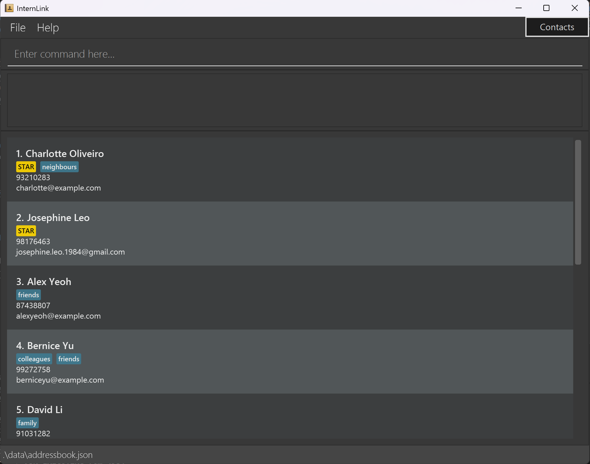
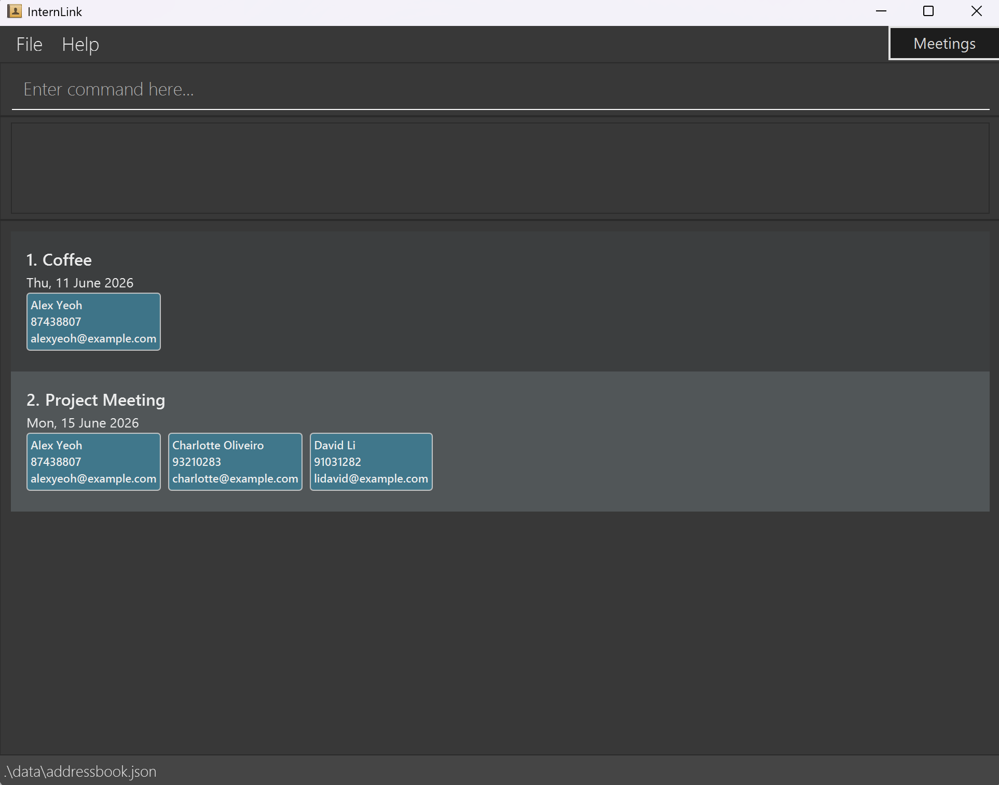

**Looking for internships can get messy fast.** \
You might meet recruiters at career fairs, talk to seniors who share opportunities, or connect with people during networking events. After a while, it gets hard to remember who’s who, where you met them, or why that contact matters. On top of that, if you set up follow-up meetings, the details can easily change and become hard to track.

**That’s where InternLink comes in!** \
InternLink helps students keep their contacts and meetings organised in one place. You can save contacts without needing to fill in too much information, and use tags to record whatever context matters to you, like company, role, event, or any other fun tidbit. You can also manage meetings flexibly by editing the details and updating who’s attending. It’s a simple way to keep track of the people you meet during your internship journey without letting everything become a mess.

**It's great for:**
* Fast typists (80 WPM and above) -- most of the user interactions happens using a CLI (Command Line Interface)
* PC Plebs -- InternLink is a desktop application only

 
 
 

* If you are interested in using AddressBook, head over to the [_Quick Start_ section of the **User Guide**](UserGuide.html#quick-start).
* If you are interested about developing AddressBook, the [**Developer Guide**](DeveloperGuide.html) is a good place to start.

**Acknowledgements**

* Libraries used: [JavaFX](https://openjfx.io/), [Jackson](https://github.com/FasterXML/jackson), [JUnit5](https://github.com/junit-team/junit5)
